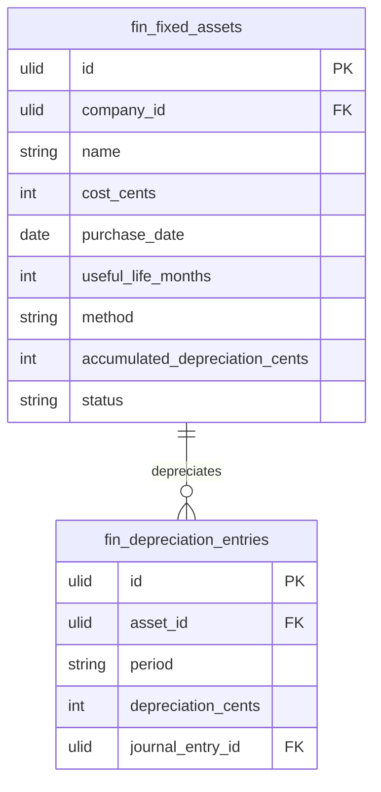

# Fixed Assets

Fixed asset register, depreciation schedules, and disposal tracking. Capitalised assets accounted over their useful life.

## Core Features

- Asset record: name, category, cost, purchase date, useful life, depreciation method, salvage value
- Depreciation methods: straight-line, declining balance, units of production
- Monthly depreciation calculation + auto-post journal entry to GL
- Net book value: cost − accumulated depreciation
- Asset disposal: sale/scrap with gain/loss calculation
- Asset categories with default depreciation settings
- Depreciation schedule view (full life projection)
- Links to IT Asset Inventory (physical asset ↔ financial asset)

## Data Model

| Table | Key Columns |
|---|---|
| `fin_fixed_assets` | company_id, name, category, cost_cents, purchase_date, useful_life_months, method, salvage_cents, accumulated_depreciation_cents, status, disposed_at |
| `fin_depreciation_entries` | asset_id, company_id, period, depreciation_cents, journal_entry_id |

## Filament

**Nav group:** Ledger

- `FixedAssetResource` — register, view schedule, dispose action
- `DepreciationRunPage` (custom page) — run monthly depreciation, post to GL

## Cross-Domain / Jobs

- Monthly depreciation via scheduled job → posts journal entries to GL
- Links to [[domains/it/asset-inventory]] physical assets

## Related

- [[domains/finance/general-ledger]]
- [[domains/it/asset-inventory]]
