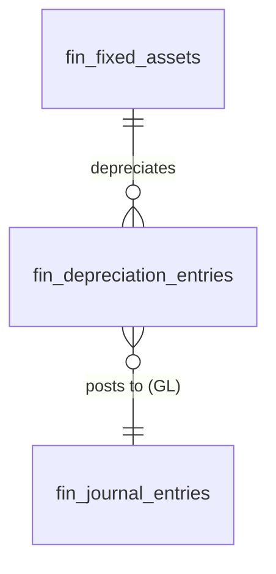

# Fixed Assets — Data Model

All monetary columns are `bigint` integer **minor units** (cents), handled with `brick/money`. Tenancy via `company_id` per [[../../../security/tenancy-isolation]]. Depreciation and disposal postings reference `fin_journal_entries` owned by [[../general-ledger/data-model|General Ledger]].

## fin_fixed_assets

| Column | Type | Constraints | Notes |
|---|---|---|---|
| id, company_id (indexed) | ulid | | |
| name | string | not null | |
| category | string | not null | category defaults applied at create |
| cost_cents | bigint | > 0 | minor units |
| purchase_date | date | not null | |
| useful_life_months | int | > 0 | |
| method | string | straight-line / declining | |
| salvage_cents | bigint | ≥ 0, < cost | minor units |
| accumulated_depreciation_cents | bigint | default 0 | minor units |
| status | string | default `active` | active / fully-depreciated / disposed |
| it_asset_id | ulid | nullable | P3 link to it.assets |
| disposed_at | timestamp | nullable | |
| disposal_proceeds_cents | bigint | nullable | minor units |
| deleted_at | timestamp | nullable | |

## fin_depreciation_entries

| Column | Type | Notes |
|---|---|---|
| id, asset_id FK, company_id (indexed) | ulid | |
| period | string | `YYYY-MM`, unique `(asset_id, period)` |
| depreciation_cents | bigint | minor units |
| journal_entry_id | ulid FK | the GL posting (→ `fin_journal_entries`) |

## ERD

See [[architecture]], [[../general-ledger/data-model]], [[../../../architecture/performance]].
