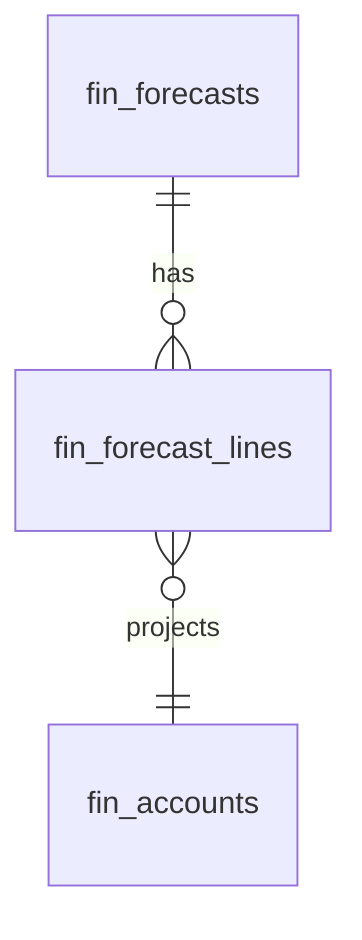

# Forecasting — Data Model

All monetary columns are `bigint` integer **minor units** (cents), handled with `brick/money`. Tenancy via `company_id` per [[../../../security/tenancy-isolation]]. The module owns the two tables below; actuals are **read** from the general ledger and budgeted figures from the budgets module.

## fin_forecasts

| Column | Type | Notes |
|---|---|---|
| id, company_id (indexed) | ulid | |
| name | string | |
| scenario | string | base / optimistic / pessimistic |
| fiscal_year | int | |
| assumptions | jsonb | `[{key, description, value}]` register |
| deleted_at | timestamp nullable | soft delete |

## fin_forecast_lines

| Column | Type | Notes |
|---|---|---|
| id, forecast_id FK, company_id | ulid | |
| account_id | ulid FK fin_accounts | |
| period | string | `YYYY-MM`, unique `(forecast_id, account_id, period)` |
| projected_cents | bigint | minor units |

## ERD

Source tables read (owned elsewhere): `fin_journal_entries` / `fin_journal_lines` (actuals), `fin_budget_lines` (budget comparison).

See [[architecture]], [[../general-ledger/data-model]], [[../budgets/data-model]].
