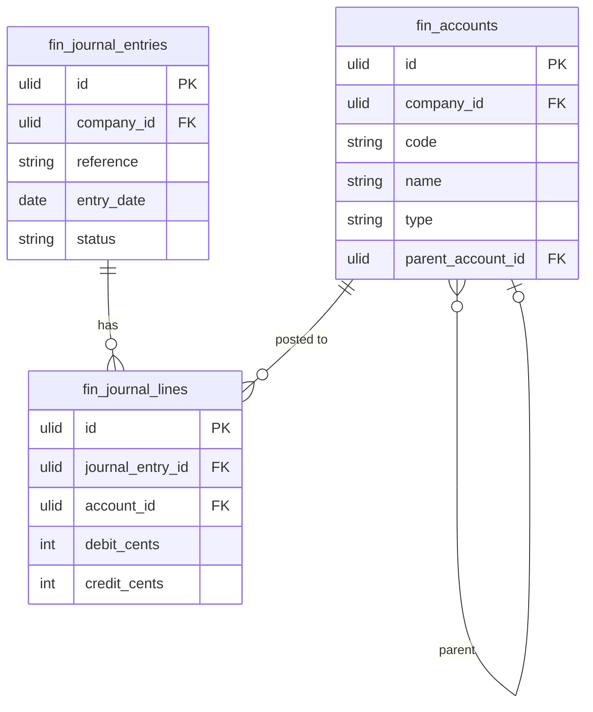

# General Ledger

Chart of accounts, double-entry journal entries, and trial balance. All financial transactions from other modules post journal entries here. The source of truth for all financial reporting.

---

## Core Features

- Chart of accounts: hierarchical account structure (assets, liabilities, equity, revenue, expenses)
- Account types: Asset, Liability, Equity, Revenue, Expense
- Journal entries: debit/credit pairs, mandatory balance (debits = credits), reference, description
- Auto-posting: invoices, payments, expenses, payroll runs create journal entries automatically
- Trial balance report: by date range
- Account balance drill-down: click account → see all journal lines for that account
- Fiscal year close: lock previous periods to prevent retroactive edits

---

## Data Model

| Table | Key Columns |
|---|---|
| `fin_accounts` | company_id, code, name, type (asset/liability/equity/revenue/expense), parent_account_id, is_active |
| `fin_journal_entries` | company_id, reference, description, entry_date, status (draft/posted), created_by |
| `fin_journal_lines` | journal_entry_id, company_id, account_id, debit_cents, credit_cents, description |

---

## Filament

**Nav group:** Ledger

- `ChartOfAccountsResource` — hierarchical account tree, create/edit accounts
- `JournalEntryResource` — list, create manual entries, view lines; auto-posted entries read-only
- `TrialBalancePage` (custom page) — date range selector, account balance table

---

## Related

- [[domains/finance/invoicing]]
- [[domains/finance/expenses]]
- [[domains/finance/financial-reporting]]
