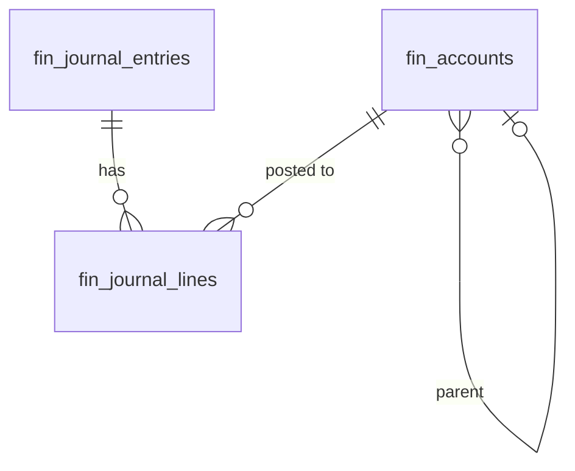

# General Ledger

Chart of accounts, double-entry journal entries, and trial balance. All financial transactions from other modules post journal entries here. The source of truth for all financial reporting — the Finance anchor, build first in `/finance`.

---

## Dependencies

| Type | Module | Why |
|---|---|---|
| Hard | [[domains/core/billing-engine\|core.billing]] + [[domains/core/rbac\|core.rbac]] | gating + permissions |
| Hard | [[domains/core/company-settings\|core.settings]] | base currency, fiscal year start |
| Soft | [[domains/finance/invoicing\|finance.invoicing]], [[domains/finance/expenses\|finance.expenses]], [[domains/hr/payroll\|hr.payroll]] | auto-posting sources; without them only manual entries exist |

---

## Core Features

- Chart of accounts: hierarchical account structure (assets, liabilities, equity, revenue, expenses); default CoA seeded per company *(assumed: standard SME chart on module activation)*
- Account types: Asset, Liability, Equity, Revenue, Expense
- Journal entries: debit/credit pairs, mandatory balance (debits = credits), reference, description
- Auto-posting: invoices, payments, expenses, payroll runs create journal entries automatically (via `LedgerService::post` — never raw inserts)
- Trial balance report: by date range
- Account balance drill-down: click account → see all journal lines for that account
- Fiscal year close: lock previous periods to prevent retroactive edits (`fin_fiscal_periods`)

---

## Data Model

### fin_accounts

| Column | Type | Constraints | Notes |
|---|---|---|---|
| id, company_id (indexed) | ulid | | |
| code | string | not null, unique `(company_id, code)` | e.g. `1100` |
| name | string | not null | |
| type | string | not null | asset / liability / equity / revenue / expense |
| parent_account_id | ulid | nullable FK self | |
| is_active | boolean | default true | inactive blocks new postings, keeps history |
| deleted_at | timestamp | nullable | undeletable once posted-to *(assumed: soft-delete blocked when lines exist)* |

### fin_journal_entries

| Column | Type | Constraints | Notes |
|---|---|---|---|
| id, company_id (indexed) | ulid | | |
| reference | string | not null | e.g. `INV-2026-001`, `PAYRUN-2026-05` |
| description | string | not null | |
| entry_date | date | not null | must fall in open fiscal period |
| status | string | default `posted` | draft (manual only) / posted |
| source_type / source_id | string / ulid nullable | | polymorphic origin (invoice, payment, payroll run) |
| created_by | ulid | nullable FK users | null = system |
| deleted_at | timestamp | nullable | posted entries NEVER deleted — reversals only |

**Indexes:** `(company_id, entry_date)`, `(company_id, source_type, source_id)`

### fin_journal_lines

| Column | Type | Constraints | Notes |
|---|---|---|---|
| id, journal_entry_id FK, company_id (indexed) | ulid | | |
| account_id | ulid | not null FK fin_accounts | |
| debit_cents / credit_cents | bigint | not null default 0; exactly one non-zero per line | |
| description | string | nullable | |

**Indexes:** `(company_id, account_id)`

### fin_fiscal_periods *(new vs v1 spec — period locking)*

| Column | Type | Notes |
|---|---|---|
| id, company_id (indexed) | ulid | |
| period | string | `YYYY-MM`, unique per company |
| status | string default `open` | open / closed |
| closed_by / closed_at | ulid / timestamp nullable | |



---

## DTOs

### CreateJournalEntryData (manual entry)
| Field | Type | Validation |
|---|---|---|
| reference | string | required, max:100 |
| description | string | required, max:255 |
| entry_date | CarbonImmutable | required; period open |
| lines | array<{account_id, debit_cents?, credit_cents?, description?}> | min:2; per line exactly one of debit/credit > 0; account active |

Cross-field: `sum(debits) === sum(credits)` — "Journal entry must balance: debits must equal credits."

### TrialBalanceData (output) — rows[] (account_code, account_name, type, debit_cents, credit_cents), totals, period

## Services & Actions

Interface→Service: `LedgerServiceInterface` → `LedgerService` — **the only write path to the ledger**.

- `post(CreateJournalEntryData $data, ?Model $source = null): JournalEntryData` — validates balance + open period inside `DB::transaction`; throws `UnbalancedEntryException`, `ClosedPeriodException`
- `reverse(string $journalEntryId, string $reason): JournalEntryData` — creates mirrored entry; original untouched
- `trialBalance(CarbonImmutable $from, CarbonImmutable $to): TrialBalanceData`
- `accountBalance(string $accountId, ?CarbonImmutable $asOf = null): Money`
- `closePeriod(string $period): void` / `reopenPeriod(string $period): void` (owner-level permission, audited)

## Events

### Consumes: PayrollRunApproved (from hr.payroll)
Listener: `PostPayrollJournalEntryListener` — queued, `WithCompanyContext`; balanced entry (gross wages expense / withholdings liability / net wages payable); throws + retries if period closed (per [[architecture/event-bus]] contract).

(Invoice/payment/expense postings are direct service calls WITHIN the finance domain — same-domain rule, no events needed.)

---

## Filament

**Nav group:** Ledger

| Artifact | Kind ([[architecture/ui-strategy]] row) | Notes |
|---|---|---|
| `ChartOfAccountsResource` | #1 CRUD resource | hierarchical tree display, code-sorted |
| `JournalEntryResource` | #1 CRUD resource | manual create only; auto-posted entries read-only; reverse action |
| `TrialBalancePage` | #9 report custom page | date range selector, drill-down to lines |
| `FiscalPeriodResource` | #1 CRUD (status toggle) | close/reopen periods |


**Access contract:** every artifact above gates on `canAccess() = Auth::user()->can('finance.ledger.view-any') && BillingService::hasModule('finance.ledger')` per [[architecture/filament-patterns]] #1 — custom pages state it explicitly. Public/portal surfaces use a guest or scoped-portal guard (Vue+Inertia per [[architecture/ui-strategy]]).

---

## Permissions

`finance.ledger.view-any` · `finance.ledger.view` · `finance.ledger.post-manual` · `finance.ledger.reverse` · `finance.ledger.manage-accounts` · `finance.ledger.close-period`

---

## Caching

| Key | TTL | Invalidated by |
|---|---|---|
| `company:{id}:finance:trial-balance:{from}:{to}` | 1 h (closed periods only) | posting into the period (writer busts) |

---

## Test Checklist

- [ ] Tenant isolation + module gating
- [ ] Unbalanced entry rejected (`UnbalancedEntryException`)
- [ ] Posting into closed period rejected (`ClosedPeriodException`); listener retries
- [ ] Posted entries immutable — no update/delete path; reversal creates mirror
- [ ] `PayrollRunApproved` posts balanced payroll entry per contract
- [ ] Trial balance debits = credits over fixture data (brick/money)
- [ ] Account with posted lines cannot be deleted
- [ ] Default CoA seeded on activation

---

## Build Manifest

```
database/migrations/xxxx_create_fin_accounts_table.php
database/migrations/xxxx_create_fin_journal_entries_table.php
database/migrations/xxxx_create_fin_journal_lines_table.php
database/migrations/xxxx_create_fin_fiscal_periods_table.php
app/Models/Finance/{Account,JournalEntry,JournalLine,FiscalPeriod}.php
app/Data/Finance/{CreateJournalEntryData,JournalEntryData,TrialBalanceData}.php
app/Contracts/Finance/LedgerServiceInterface.php
app/Services/Finance/LedgerService.php
app/Providers/Finance/FinanceServiceProvider.php
app/Exceptions/Finance/{UnbalancedEntryException,ClosedPeriodException}.php
app/Listeners/Finance/PostPayrollJournalEntryListener.php
database/seeders/DefaultChartOfAccountsSeeder.php
app/Filament/Finance/Resources/{ChartOfAccountsResource,JournalEntryResource,FiscalPeriodResource}.php
app/Filament/Finance/Pages/TrialBalancePage.php
database/factories/Finance/{AccountFactory,JournalEntryFactory}.php
tests/Feature/Finance/{LedgerPostingTest,PeriodLockTest,PayrollPostingTest}.php
```

---

## Related

- [[domains/finance/invoicing]]
- [[domains/finance/expenses]]
- [[domains/finance/financial-reporting]]
- [[architecture/event-bus]]
