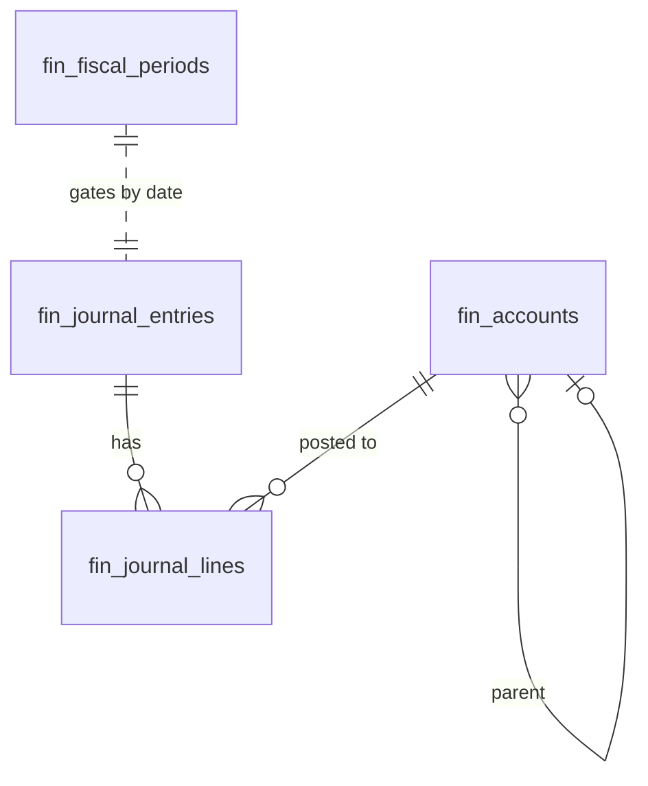

# General Ledger — Data Model

All monetary columns are `bigint` integer **minor units** (cents), handled with `brick/money`. Tenancy via `company_id` per [[../../../security/tenancy-isolation]].

## fin_accounts

| Column | Type | Constraints | Notes |
|---|---|---|---|
| id, company_id (indexed) | ulid | | |
| code | string | not null, unique `(company_id, code)` | e.g. `1100` |
| name | string | not null | |
| type | string | not null | asset / liability / equity / revenue / expense |
| parent_account_id | ulid | nullable FK self | |
| is_active | boolean | default true | inactive blocks new postings, keeps history |
| deleted_at | timestamp | nullable | undeletable once posted-to *(assumed: soft-delete blocked when lines exist)* |

## fin_journal_entries

| Column | Type | Constraints | Notes |
|---|---|---|---|
| id, company_id (indexed) | ulid | | |
| reference | string | not null | e.g. `INV-2026-001`, `PAYRUN-2026-05` |
| description | string | not null | |
| entry_date | date | not null | must fall in open fiscal period |
| status | string | default `posted` | draft (manual only) / posted |
| source_type / source_id | string / ulid nullable | | polymorphic origin (invoice, payment, payroll run) |
| created_by | ulid | nullable FK users | null = system |
| deleted_at | timestamp | nullable | posted entries NEVER deleted — reversals only |

**Indexes:** `(company_id, entry_date)`, `(company_id, source_type, source_id)`

## fin_journal_lines

| Column | Type | Constraints | Notes |
|---|---|---|---|
| id, journal_entry_id FK, company_id (indexed) | ulid | | |
| account_id | ulid | not null FK fin_accounts | |
| debit_cents / credit_cents | bigint | not null default 0; exactly one non-zero per line | minor units |
| description | string | nullable | |

**Indexes:** `(company_id, account_id)`

## fin_fiscal_periods *(new vs v1 spec — period locking)*

| Column | Type | Notes |
|---|---|---|
| id, company_id (indexed) | ulid | |
| period | string | `YYYY-MM`, unique per company |
| status | string default `open` | open / closed |
| closed_by / closed_at | ulid / timestamp nullable | |

## ERD

See [[architecture]], [[../../../architecture/data-model]].
