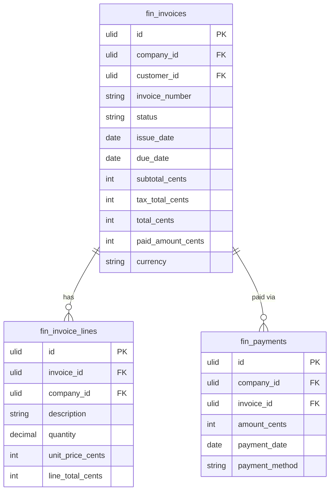

# Invoicing

Customer invoice creation, sending, payment tracking, and recurring invoice automation. Core revenue tracking for every SME.

---

## Core Features

- Invoice creation: customer, line items (description, qty, unit price, tax rate), discount, notes
- Invoice status lifecycle: `draft → sent → partially_paid → paid → overdue | voided` (spatie/laravel-model-states)
- PDF generation via `spatie/laravel-pdf` (Chromium-based, CSS-rendered) and email delivery to customer
- Payment recording: mark as paid (manual), partial payments supported
- Recurring invoices: schedule (monthly/quarterly/annually), auto-generate and send
- Invoice numbering: configurable prefix, auto-increment per company (e.g. INV-2026-001)
- Late payment: overdue detection, reminder email on configurable days-past-due
- Tax calculation: applied per line item from configured tax rates
- Integration with CRM: create invoice from a won deal
- Export invoice list via `pxlrbt/filament-excel`

---

## Data Model

| Table | Key Columns |
|---|---|
| `fin_invoices` | company_id, customer_id, invoice_number, status, issue_date, due_date, subtotal, tax_total, total, paid_amount, currency, recurring_schedule |
| `fin_invoice_lines` | invoice_id, company_id, description, quantity, unit_price, tax_rate_id, line_total |
| `fin_payments` | company_id, invoice_id, amount, payment_date, payment_method, reference_number |

---

## Filament

**Nav group:** Invoicing

- `InvoiceResource` — list (filter by status, date range), create, edit, view
- View page: invoice preview + payment history + action buttons (Send, Record Payment, Mark Void)
- `InvoiceStatsWidget` — total outstanding, overdue count, paid this month
- Export via `pxlrbt/filament-excel`

---

## Related

- [[domains/finance/accounts-receivable]]
- [[domains/finance/general-ledger]] — approved payment creates journal entry
- [[domains/crm/deals]] — invoice created from won deal
- [[domains/finance/tax-management]]
