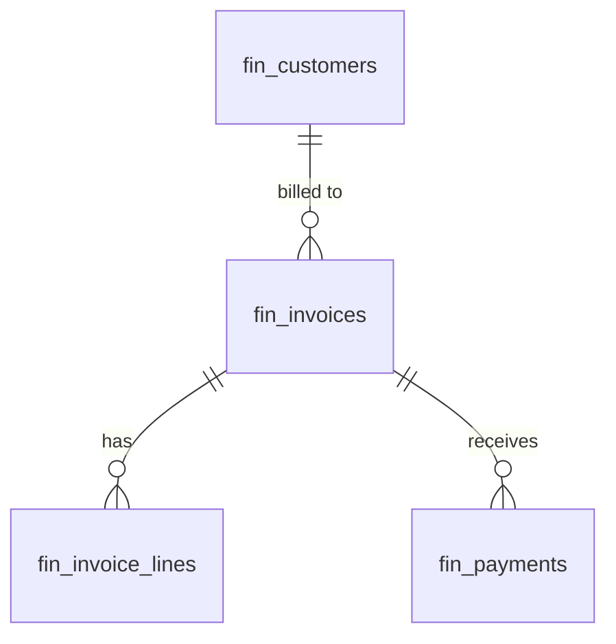

# Invoicing — Data Model

All monetary columns are `bigint` integer **minor units** (cents), handled with `brick/money`. Tenancy via `company_id` per [[../../../security/tenancy-isolation]].

## fin_customers *(new vs v1 spec — invoice recipient record, links to CRM when active)*

| Column | Type | Notes |
|---|---|---|
| id, company_id (indexed) | ulid | |
| name | string | |
| email | string | invoice delivery |
| address | jsonb | billing address |
| vat_number | string nullable | |
| crm_account_id | ulid nullable | link when CRM active |
| payment_terms_days | int | default from settings *(assumed 14)* |
| deleted_at | timestamp | nullable |

## fin_invoices

| Column | Type | Constraints | Notes |
|---|---|---|---|
| id, company_id (indexed) | ulid | | |
| customer_id | ulid | not null FK fin_customers | |
| invoice_number | string | not null, unique `(company_id, invoice_number)` | sequential per company |
| status | string | default `draft` | state machine |
| issue_date / due_date | date | due ≥ issue | |
| subtotal_cents / tax_total_cents / total_cents / paid_amount_cents | bigint | not null default 0 | minor units |
| currency | string(3) | not null | base unless multi-currency |
| exchange_rate | decimal(12,6) | nullable | multi-currency only |
| discount_percent | decimal(5,2) | default 0 | |
| notes | text | nullable | |
| recurring_schedule | string | nullable | monthly / quarterly / annually |
| next_recurring_at | date | nullable | |
| source_deal_id | ulid | nullable | DealWon origin |
| pdf_path | string | nullable | tenant-scoped |
| deleted_at | timestamp | nullable | kept 7y per [[../../../architecture/data-lifecycle]] |

**Indexes:** `(company_id, status)`, `(company_id, due_date)`, `(company_id, customer_id)`

## fin_invoice_lines

| Column | Type | Notes |
|---|---|---|
| id, invoice_id FK, company_id | ulid | |
| description | string | |
| quantity | decimal(10,2) | min 0.01 |
| unit_price_cents | bigint | minor units |
| tax_rate_id | ulid nullable | finance.tax |
| tax_cents / line_total_cents | bigint | computed |

## fin_payments

| Column | Type | Notes |
|---|---|---|
| id, company_id (indexed), invoice_id FK | ulid | |
| amount_cents | bigint | > 0, ≤ remaining balance |
| payment_date | date | |
| payment_method | string | bank-transfer / stripe / cash / other |
| reference_number | string nullable | |

## ERD

See [[architecture]], [[../../../architecture/data-model]].
