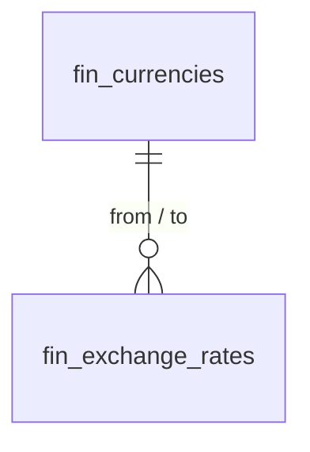

# Multi-Currency — Data Model

Monetary amounts are integer **minor units**, handled with `brick/money`; per-currency precision is `minor_unit_digits`. Exchange rates are `decimal(16,8)`. Tenancy via `company_id` per [[../../../security/tenancy-isolation]].

## fin_currencies

| Column | Type | Notes |
|---|---|---|
| id, company_id (indexed) | ulid | |
| code | string(3) | ISO 4217, unique per company |
| symbol | string | |
| minor_unit_digits | int | 0–3 (JPY=0, BHD=3, most=2) |
| is_active | boolean | |

## fin_exchange_rates

| Column | Type | Notes |
|---|---|---|
| id, company_id (indexed) | ulid | |
| from_currency / to_currency | string(3) | |
| rate | decimal(16,8) | |
| effective_date | date | unique `(company_id, from, to, effective_date)` |

## Per-record currency columns (owned by consuming modules)

Invoices/bills/expenses carry `currency` + `exchange_rate` columns. The migration is intended to be added by those modules; this module activates the input.

## ERD

See [[architecture]], [[../../../architecture/data-model]].
