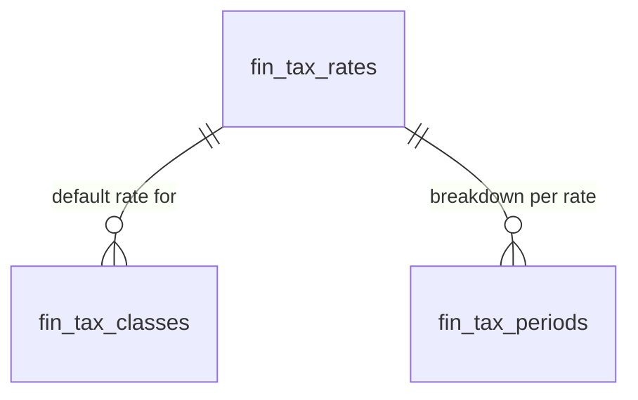

# Tax Management — Data Model

All monetary columns are `bigint` integer **minor units** (cents), handled with `brick/money`. Tax rates are stored as integer basis points. Tenancy via `company_id` per [[../../../security/tenancy-isolation]].

## fin_tax_rates

| Column | Type | Notes |
|---|---|---|
| id, company_id (indexed) | ulid | |
| name | string | e.g. "NL High 21%" |
| rate_basis_points | int | 2100 = 21% — integer, no float *(was rate_percent in v1 spec)* |
| type | string | vat / gst / sales-tax |
| jurisdiction | string | ISO country |
| is_reverse_charge | boolean | default false |
| is_active | boolean | default true |
| deleted_at | timestamp nullable | rates referenced by lines never hard-deleted |

## fin_tax_classes

| Column | Type | Notes |
|---|---|---|
| id, company_id (indexed) | ulid | |
| name | string | standard / reduced / zero / exempt |
| default_rate_id | ulid FK fin_tax_rates | |

## fin_tax_periods

| Column | Type | Notes |
|---|---|---|
| id, company_id (indexed) | ulid | |
| period | string | `YYYY-Qn` or `YYYY-MM`, unique per company |
| output_tax_cents / input_tax_cents / net_payable_cents | bigint | computed snapshot |
| status | string default `open` | open / filed |

## ERD

See [[architecture]], [[../../../architecture/data-model]].
