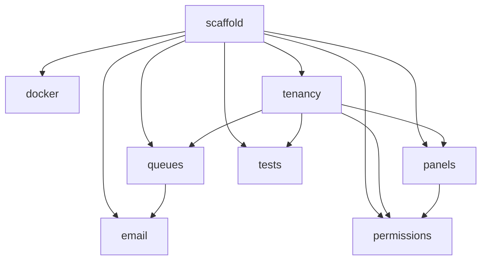

# Foundation

Application scaffold — invisible to company users, required by everything else. No Filament panel for this domain.

**Build this first.** Nothing in Phase 1+ works without it. Milestone M0 in [[build/ROADMAP]].

---

## Modules

| Module | Key | Status | Priority | Depends on (intra-domain) |
|---|---|---|---|---|
| [[domains/foundation/laravel-scaffold\|Laravel Scaffold]] | `foundation.scaffold` | planned | v1-core | — |
| [[domains/foundation/docker-environment\|Docker Environment]] | `foundation.docker` | planned | v1-core | scaffold |
| [[domains/foundation/multi-tenancy-layer\|Multi-Tenancy Layer]] | `foundation.tenancy` | planned | v1-core | scaffold |
| [[domains/foundation/queue-workers\|Queue Workers & Scheduler]] | `foundation.queues` | planned | v1-core | scaffold, tenancy |
| [[domains/foundation/email-setup\|Email Setup]] | `foundation.email` | planned | v1-core | scaffold, queues |
| [[domains/foundation/filament-panels\|Filament Panels]] | `foundation.panels` | planned | v1-core | scaffold, tenancy |
| [[domains/foundation/permissions-seed\|Permissions Seeder]] | `foundation.permissions` | planned | v1-core | scaffold, tenancy, panels |
| [[domains/foundation/test-suite\|Test Suite]] | `foundation.tests` | planned | v1-core | scaffold, tenancy |

## Dependency Graph



## Cross-Domain Edges

None — Foundation fires and consumes no events. It provides the event/queue/tenancy machinery every other domain uses.

---

## Status Board (Dataview)

```dataview
TABLE module-key AS "Key", status AS "Status"
FROM "domains/foundation"
WHERE type = "module"
SORT module-key ASC
```

---

## Key Constraints

- No public company registration — companies created by FlowFlex staff in `/admin`
- All tenant models carry `company_id` + `BelongsToCompany` trait
- ULID PKs on every table
- `spatie/laravel-permission` with `teams = true` — roles scoped to `company_id`
- Two completely separate Filament guards: `admin` (Admin model) and `web` (User model)

**M0 exit gate**: `php artisan migrate --seed` runs clean · demo company + owner login works · one passing tenant-isolation test · Docker stack healthy · CI green.

## Key Patterns

- [[architecture/multi-tenancy]] — full multi-tenancy implementation
- [[architecture/filament-patterns]] — panel provider and resource conventions
- [[architecture/patterns/belongs-to-company]] — model trait requirements
- [[architecture/patterns/testing-pattern]] — test suite setup
- [[architecture/local-dev]] — .env spec, docker, troubleshooting
