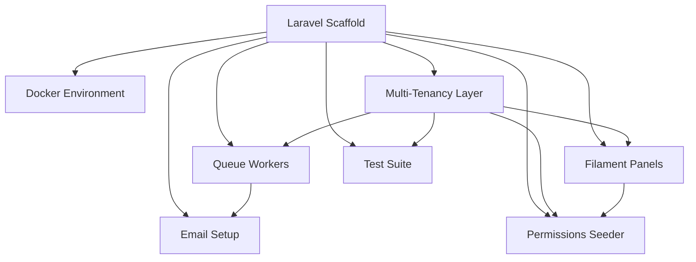

# Foundation

Platform plumbing — invisible to tenant users, required by everything else. No business panel of its own; it provides the scaffold, tenancy, queues, mail, panels, seeders, and test harness every other domain builds on. **Build these first.** All eight modules are `planned` — the app was removed 2026-06-20 ([[../../decisions/decision-2026-06-20-app-project-removed]]); these specs are the last-known-good blueprint, captured from the codebase before deletion.

## Modules

| Module | Key | Build | Kind highlights |
|---|---|---|---|
| [[laravel-scaffold/_module\|Laravel Scaffold]] | `foundation.scaffold` | planned | backend — Filament Artifacts None |
| [[docker-environment/_module\|Docker Environment]] | `foundation.docker` | planned | backend (local-dev infra) — None |
| [[multi-tenancy-layer/_module\|Multi-Tenancy Layer]] | `foundation.tenancy` | planned | backend (scope/context substrate) — None |
| [[queue-workers/_module\|Queue Workers & Scheduler]] | `foundation.queues` | planned | backend + external `/horizon` dashboard (admin guard) |
| [[email-setup/_module\|Email Setup]] | `foundation.email` | planned | backend (mail + webhook) — None |
| [[filament-panels/_module\|Filament Panels]] | `foundation.panels` | planned | **panel shells** `/admin` + `/app` + Filament auth pages (login/2FA/profile) |
| [[permissions-seed/_module\|Permissions Seeder]] | `foundation.permissions` | planned | backend (artisan seeders) — None |
| [[test-suite/_module\|Test Suite]] | `foundation.tests` | planned | backend (Pest + CI) — None |

## Dependency Graph

## Verified Reality (corrections from the old flat specs)

- **Docker**: **9** services (adds `scheduler`); only nginx `8080:80` + postgres `5432:5432` host-published; Reverb on `--port=8081`; Redis `--requirepass secret`. → [[../../infrastructure/docker-stack]]
- **Scaffold**: PHP `^8.3` (not 8.4); `users` = `first_name`/`last_name`, unique `(company_id,email)`.
- **Panels**: only **2** (`/admin`, `/app`) + shared `Auth` namespace; domain panels stripped.
- **Queues**: `hr`/`finance` queue names exist but are **empty** until those domains return.
- **Permissions**: `PermissionSeeder` seeds **core perms only**; one `LocalDevSeeder` creates `admin@flowflex.nl`/`password`, `demo@flowflex.nl`/`password`, `test@test.nl`/`test1234` (real working login).
- **Tests**: ~186 tests / 33 files / 3 suites; CI matrix PHP 8.3/8.4/8.5.

## Cross-Domain Edges

Foundation fires and consumes **no domain events** — it *provides* the event/queue/tenancy/mail/panel/permission
machinery every other domain runs on. Its cross-domain relations are therefore "provides-substrate" and a few
inbound reads, not event flows:

| Direction | Edge | Detail |
|---|---|---|
| provides | **tenancy** → every domain | `CompanyScope` + `WithCompanyContext` scope all reads/writes/jobs ([[multi-tenancy-layer/_module]]) |
| provides | **queues** → every domain | Horizon processes every domain's jobs/listeners ([[queue-workers/_module]]) |
| provides | **panels** → every domain | `/app` shell hosts all domain resources; `/admin` hosts staff tooling ([[filament-panels/_module]]) |
| provides | **permission universe** → [[../core/rbac/_module\|core.rbac]] | seeded `core.*` perms = the assignable set |
| reads | branding ← [[../core/company-settings/_module\|core.company-settings]] | mailable + panel skin read company name/logo/colour |
| reads | subscription status ← [[../core/billing-engine/_module\|core.billing]] | `EnsureSubscriptionActive` gates `/app` |
| reads | setup flag ← [[../core/setup-wizard/_module\|core.setup-wizard]] | `RedirectToSetupWizard` on `setup_completed_at` |
| owns-shared | `companies` / `users` / `admins` | foundation-owned, read by many domains ([[laravel-scaffold/data-model]]) |

Full matrix: [[../../architecture/cross-domain-relations]].

## Key Constraints

- No public company registration — tenants created by FlowFlex staff in `/admin`.
- All tenant models carry `company_id` + `BelongsToCompany`; ULID PKs everywhere.
- `spatie/laravel-permission`, `teams = company_id`.
- Two separate guards: `admin` (Admin) and `web` (User) — never overlap.

**M0 exit gate** (met): `migrate --seed` clean · demo owner login works · tenant-isolation test green · Docker stack healthy · CI green.

## Opportunities

Web-researched differentiators / gaps for the platform layer: [[_opportunities|Foundation Opportunities]] —
strengths to promote (tenant-context-in-queue, per-tenant demo data, painless RBAC seeding) and gaps to
roadmap (queue push-alerting, Filament relation-manager tenant scoping).

## Related

- [[_opportunities|Foundation Opportunities]]
- [[../../infrastructure/_moc|Infrastructure MOC]]
- [[../../security/_moc|Security MOC]]
- [[../../architecture/multi-tenancy]] · [[../../architecture/filament-patterns]]
- [[../../glossary]]
