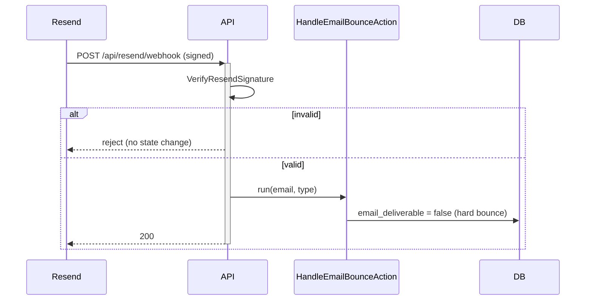

# Email Setup — API

One inbound endpoint, verified in `routes/api.php`.

## `POST /api/resend/webhook`

| Aspect | Value |
|---|---|
| Controller | `ResendWebhookController` (invokable) |
| Middleware | `VerifyResendSignature`, `throttle:60,1` |
| Session/CSRF | none (stateless API route) |
| Name | `webhooks.resend` |
| Purpose | bounce/complaint events → flag `users.email_deliverable` via `HandleEmailBounceAction` |

> [!warning] UNVERIFIED — needs confirmation: exact signature scheme
> Verified that `VerifyResendSignature` middleware exists and gates the route. The exact header name / secret env var (e.g. Svix `RESEND_WEBHOOK_SECRET`) and the rejection status code were not read from the middleware body here.

## Related

- [[_module|Email Setup]] · [[security|Security]]
- [[../../../security/webhooks-signing]]
