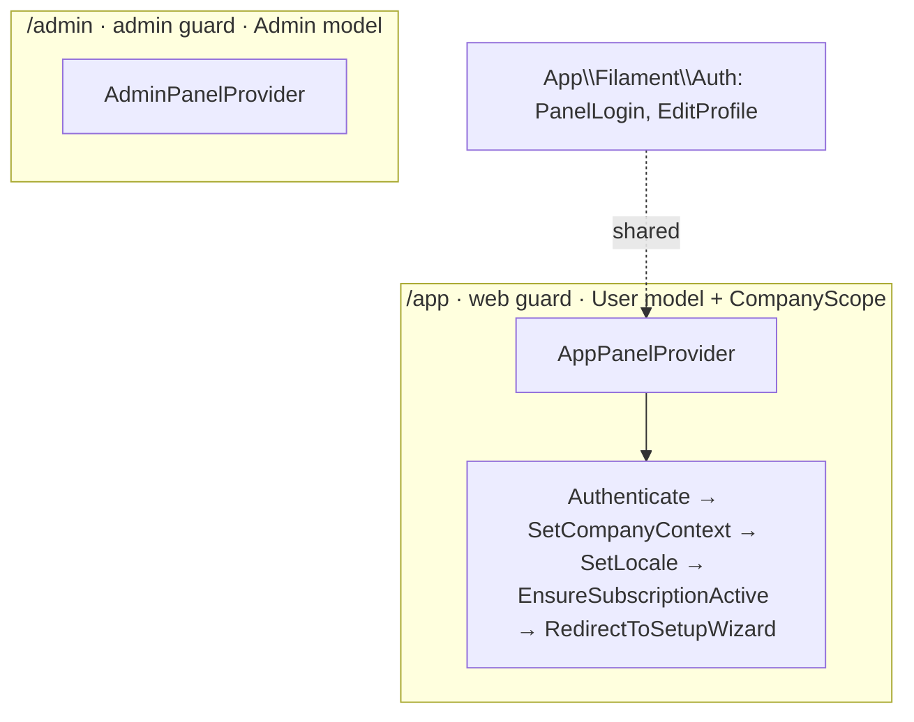

# Filament Panels

`foundation.panels` — the Filament 5 panel shells. **Only 2 panels exist** today: Admin (`/admin`) and App (`/app`), plus a shared `App\Filament\Auth` namespace (`PanelLogin`, `EditProfile`).

## Module-key

`foundation.panels`

**Priority:** v1-core (M0)  
**Panel:** provides `/admin` + `/app` (+ shared `App\Filament\Auth`)  
**Permission prefix:** none (the guard split is the boundary; per-resource `canAccess()` lives in the domain modules that mount into `/app`)  
**Tables:** none owned (uses the scaffold's `users` / `admins`)

## Dependencies

| Type | Module | Why |
|---|---|---|
| Hard | [[../laravel-scaffold/_module\|foundation.scaffold]] | `User` / `Admin` models + auth config |
| Hard | [[../multi-tenancy-layer/_module\|foundation.tenancy]] | `SetCompanyContext` in the `/app` auth chain |
| Soft | [[../../core/billing-engine/_module\|core.billing]] | `EnsureSubscriptionActive` gate on `/app` |
| Soft | [[../../core/setup-wizard/_module\|core.setup-wizard]] | `RedirectToSetupWizard` on `setup_completed_at` |

## Core Features

- Two panel shells: `/admin` (admin guard, no scope, Indigo) + `/app` (web guard, CompanyScope, sky) — see [[./features/admin-panel-shell|Admin Shell]] · [[./features/app-panel-shell|App Shell]]
- Shared `Filament\Auth`: login, password reset, email verify, 2FA, profile — see [[./features/panel-auth|Panel Auth]]
- Persistent auth-middleware chain (`isPersistent: true`) — Livewire-safe, avoids the null-team 403 family
- Switchboard+ skin ([[../../../frontend/design-system]]), database notifications (30s poll)

> [!note] Corrected from flat spec
> The old spec implied 21 domain panels and shipped a stale provider template (wrong `Color::Slate` primary, `authModel()`, `ThemeMode` misuse, illustrative middleware). The HR/Finance/CRM domain panels were stripped with their domains. Below is the **real** `AppPanelProvider`. Domain panels return when their domains are rebuilt.

## Panels (verified in `app/Providers/Filament/`)

| Panel | Provider | Guard | Model | Scope |
|---|---|---|---|---|
| `/admin` | `AdminPanelProvider` | `admin` | `Admin` | no CompanyScope; primary `Color::Indigo`, gray `Slate` |
| `/app` | `AppPanelProvider` | `web` | `User` | CompanyScope active; primary sky `#38BDF8`, gray `Slate` |
| (shared) | `App\Filament\Auth\{PanelLogin,EditProfile}` | — | — | login + profile UI |



## Real `/app` provider (key lines, verified)

```php
$panel->id('app')->path('app')
    ->login(PanelLogin::class)->passwordReset()->emailVerification()
    ->multiFactorAuthentication(AppAuthentication::make()->recoverable())
    ->profile(EditProfile::class, isSimple: false)
    ->authGuard('web')->authPasswordBroker('users')
    ->brandName('FlowFlex')
    ->colors(['primary' => Color::hex('#38BDF8'), 'gray' => Color::Slate])
    ->font('Instrument Sans')
    ->defaultThemeMode(ThemeMode::System)
    ->sidebarCollapsibleOnDesktop()
    ->viteTheme('resources/css/filament/app/theme.css')
    ->databaseNotifications()->databaseNotificationsPolling('30s')
    ->authMiddleware([
        Authenticate::class, SetCompanyContext::class, SetLocale::class,
        EnsureSubscriptionActive::class, RedirectToSetupWizard::class,
    ], isPersistent: true); // Livewire POSTs re-run context — else null-team 403
```

Note: no `authModel()` call — Filament resolves the model from the guard's provider. Middleware order: `Authenticate` **before** `SetCompanyContext` ([[../../../architecture/filament-patterns]] #7).

## Security

- Login throttling on both panels (Filament default login rate limit). See [[../../../security/authn-authz]] and [[../../../architecture/security]] for limit values.
- The guard split IS the authorization boundary: `admin` never overlaps `web`.

## Test Checklist (verified)

- [ ] Tenant isolation: the guard split (`/app` web+CompanyScope vs `/admin` admin+no-scope) is the coarse isolation wall; `SetCompanyContext` scopes every `/app` request to the user's company
- [ ] Module gating: n/a — `foundation.panels` *provides* the always-on panels; it is not itself gated. The domain resources/pages mounting into `/app` are the module-gated artifacts
- [x] `/admin` login works with Admin; tenant `User` rejected on `/admin` (`tests/Feature/PanelAuthTest.php`)
- [x] `/app` login works with User; `Admin` rejected on `/app`
- [x] `SetCompanyContext` runs on every authenticated `/app` request
- [x] Unauthenticated `/app` redirects to login without `MissingCompanyContextException`

## Build Manifest

```
app/Providers/Filament/AdminPanelProvider.php
app/Providers/Filament/AppPanelProvider.php
app/Filament/Auth/{PanelLogin,EditProfile}.php
config/auth.php (admin guard + provider)
app/Http/Middleware/{SetLocale,EnsureSubscriptionActive,RedirectToSetupWizard}.php
resources/css/filament/{admin,app}/theme.css
tests/Feature/PanelAuthTest.php
```

## Build notes (2026-07-03)

- **Switchboard+ skin implemented**: shared `resources/css/filament/flowflex-skin.css` imported by both per-panel `theme.css` files (bunny-fonts Instrument Sans + JetBrains Mono self-hosted at build, `--ff-panel-label` = `WORKSPACE` / `/ADMIN`), wired via `viteTheme` + Vite inputs. Selectors verified against rendered Filament 5 markup (`fi-sidebar-*`, `fi-topbar`, `fi-simple-layout`, `fi-ta-*`). Ink sidebar + paper canvas + mono meta + login parity live.
- **Auth split shell implemented** (design handoff §8–11): overridden `filament-panels::layout.simple` renders the 620px `#0E1320` brand panel (radial indigo glow, 3 animated flow pulses `stroke-dasharray 26 200` 4.5s staggered, reduced-motion gated) on Login pages only; forgot/reset stay centered. Per-panel copy ("Everything flows." vs `FLOWFLEX STAFF · /ADMIN` + "Platform operations."), 420px/20px-radius card, ink staff button + ink `/ADMIN` chip, mono trust line.
- **Panel skin scheme-aware** (2026-07-03): sidebar follows light/dark (owner decision, amends the 'ink both modes' rule); nav metrics per handoff panel.css (8px items, 2px spine, active 0-8-8-0 radius, mono 10.5px group labels), 9px buttons, warm/dark topbar variants. Filament v5 gotchas locked in: primary vars need color-mix (never rgb(var())), active item = li.fi-active not .fi-sidebar-item-active, input borders are ring-shadows. Tabs/pagination/table design rules land verified when the first resource ships.
- **Render-hook chrome shipped 2026-07-03**: sidebar footer (user card + "Your panels" chips — chips render only when the user can access >1 panel), topbar crumb (panel › page, route-derived), 320px ⌘K search trigger dispatching ff-spotlight-open (listener lands with core.spotlight). Auth screens forced always-light (owner decision) — toggle removed, brand-panel glow removed.

## Related

- [[../../../architecture/filament-patterns]]
- [[../../../architecture/patterns/filament-panel-chrome]]
- [[../../../security/authn-authz]]
- [[../multi-tenancy-layer/_module|Multi-Tenancy Layer]]
- [[../../../glossary]]
