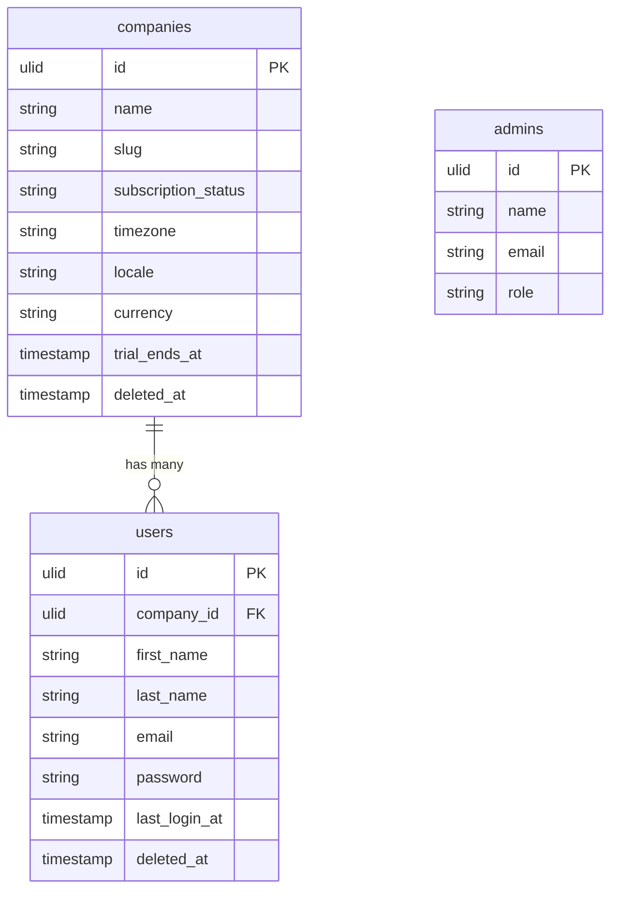

# Laravel Scaffold

Laravel 13 project skeleton with all core packages installed and configured. Establishes the conventions every other module must follow: ULID PKs, strict types, soft deletes, PostgreSQL-only, Redis for cache/queues/sessions, directory structure organised by domain.

---

## Core Features

- Laravel 13 + PHP 8.4: strict types, readonly properties, backed enums, named arguments
- Packages: `spatie/laravel-data`, `spatie/laravel-permission` (teams=true), `spatie/laravel-activitylog`, `spatie/laravel-media-library`
- Laravel Horizon (queue monitoring), Reverb (WebSocket), Pulse (health metrics), Telescope (dev only)
- PostgreSQL 17 primary database; Redis 8 for cache, queues, sessions
- ULID PKs everywhere via `HasUlids` — no integer IDs
- `spatie/laravel-permission` with `teams = true` — roles scoped to `company_id`
- Directory structure: `app/Contracts/{Domain}/`, `app/Services/{Domain}/`, `app/Providers/{Domain}/`, `app/Data/{Domain}/`, `app/Actions/{Domain}/`, `app/Filament/Admin/`, `app/Filament/App/`
- Queue configuration: separate queues per domain (`hr`, `finance`, `crm`, `default`)
- API route prefix `/api/v1/`, JSON responses with ISO 8601 timestamps
- No Breeze, Jetstream, or Fortify — Filament handles all authentication

---

## Install Manifest (build step 1)

The exact dependency install for a fresh project. Run after `composer create-project laravel/laravel`.

```bash
# Core backend
composer require filament/filament:"^5.0"
composer require laravel/horizon laravel/pulse laravel/reverb laravel/sanctum
composer require spatie/laravel-data spatie/laravel-permission spatie/laravel-activitylog
composer require spatie/laravel-medialibrary spatie/laravel-typescript-transformer
composer require spatie/laravel-model-states spatie/laravel-settings spatie/laravel-sluggable
composer require spatie/laravel-health spatie/laravel-backup
composer require spatie/laravel-tags spatie/laravel-schemaless-attributes
composer require lorisleiva/laravel-actions calebporzio/sushi
composer require brick/money propaganistas/laravel-phone ezyang/htmlpurifier
composer require stripe/stripe-php sentry/sentry-laravel
composer require maatwebsite/excel spatie/laravel-pdf
composer require simplesoftwareio/simple-qrcode spatie/icalendar-generator
composer require dedoc/scramble

# Filament plugins
composer require bezhansalleh/filament-shield
composer require pxlrbt/filament-excel awcodes/filament-tiptap-editor
composer require saade/filament-fullcalendar leandrocfe/filament-apex-charts
composer require rmsramos/activitylog codewithdennis/filament-select-tree
composer require filament/spatie-laravel-media-library-plugin

# Dev
composer require --dev pestphp/pest pestphp/pest-plugin-laravel pestphp/pest-plugin-livewire
composer require --dev nunomaduro/larastan laravel/pint laravel/telescope brianium/paratest

# Frontend
npm install vue@^3.5 @inertiajs/vue3 @vueuse/core typescript
npm install -D vite @vitejs/plugin-vue tailwindcss@^4 ziggy-js pinia
npm install -D vitest @playwright/test eslint prettier
```

After install: see [[domains/foundation/permissions-seed]] for seeding and [[build/BUILD-ORDER]] for the build sequence.

---

## Data Model

| Table | Key Columns |
|---|---|
| `companies` | id (ULID), name, slug (unique), subscription_status, timezone, locale, currency, trial_ends_at, deleted_at |
| `users` | id (ULID), company_id FK, first_name, last_name, email, password, two_factor_enabled, email_verified_at, last_login_at, deleted_at |
| `admins` | id (ULID), name, email, password, role enum(super_admin, support, billing, developer), deleted_at |



---

## Filament

No Filament resource — scaffold only. Company and user management surfaces in the Core Platform and the `/admin` panel.

---

## Related

- [[domains/foundation/filament-panels]]
- [[domains/foundation/multi-tenancy-layer]]
- [[architecture/tech-stack]]
- [[architecture/data-model]]
