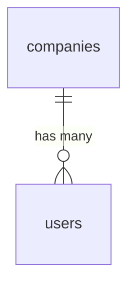

# Laravel Scaffold

Laravel 13 project skeleton with all core packages installed and configured. Establishes the conventions every other module must follow: ULID PKs, strict types, soft deletes, PostgreSQL-only, Redis for cache/queues/sessions, directory structure organised by domain. **The very first thing built — nothing exists before this.**

---

## Dependencies

| Type | Module | Why |
|---|---|---|
| — | none | first module in the build order |

---

## Core Features

- Laravel 13 + PHP 8.4: strict types, readonly properties, backed enums, named arguments
- Packages: `spatie/laravel-data`, `spatie/laravel-permission` (teams=true), `spatie/laravel-activitylog`, `spatie/laravel-media-library`
- Laravel Horizon (queue monitoring), Reverb (WebSocket), Pulse (health metrics), Telescope (dev only)
- PostgreSQL 17 primary database; Redis 8 for cache, queues, sessions
- ULID PKs everywhere via `HasUlids` — no integer IDs
- `spatie/laravel-permission` with `teams = true` — roles scoped to `company_id`
- Directory structure: `app/Contracts/{Domain}/`, `app/Services/{Domain}/`, `app/Providers/{Domain}/`, `app/Data/{Domain}/`, `app/Actions/{Domain}/`, `app/Filament/Admin/`, `app/Filament/App/`
- Queue configuration: separate queues per domain (`hr`, `finance`, `crm`, `default`)
- API route prefix `/api/v1/`, JSON responses with ISO 8601 timestamps
- No Breeze, Jetstream, or Fortify — Filament handles all authentication

---

## Install Manifest (build step 1)

The exact dependency install for a fresh project. Run after `composer create-project laravel/laravel`.

```bash
# Core backend
composer require filament/filament:"^5.0"
composer require laravel/horizon laravel/pulse laravel/reverb laravel/sanctum
composer require spatie/laravel-data spatie/laravel-permission spatie/laravel-activitylog
composer require spatie/laravel-medialibrary spatie/laravel-typescript-transformer
composer require spatie/laravel-model-states spatie/laravel-settings spatie/laravel-sluggable
composer require spatie/laravel-health spatie/laravel-backup
composer require spatie/laravel-tags spatie/laravel-schemaless-attributes
composer require lorisleiva/laravel-actions calebporzio/sushi
composer require brick/money propaganistas/laravel-phone ezyang/htmlpurifier
composer require stripe/stripe-php sentry/sentry-laravel
composer require maatwebsite/excel spatie/laravel-pdf
composer require simplesoftwareio/simple-qrcode spatie/icalendar-generator
composer require dedoc/scramble

# Filament plugins
composer require bezhansalleh/filament-shield
composer require pxlrbt/filament-excel awcodes/filament-tiptap-editor
composer require saade/filament-fullcalendar leandrocfe/filament-apex-charts
composer require rmsramos/activitylog codewithdennis/filament-select-tree
composer require filament/spatie-laravel-media-library-plugin

# Dev
composer require --dev pestphp/pest pestphp/pest-plugin-laravel pestphp/pest-plugin-livewire
composer require --dev nunomaduro/larastan laravel/pint laravel/telescope brianium/paratest

# Frontend
npm install vue@^3.5 @inertiajs/vue3 @vueuse/core typescript
npm install -D vite @vitejs/plugin-vue tailwindcss@^4 ziggy-js pinia
npm install -D vitest @playwright/test eslint prettier
```

After install: see [[domains/foundation/permissions-seed]] for seeding and [[build/BUILD-ORDER]] for the build sequence.

---

## Data Model

### companies

| Column | Type | Constraints | Notes |
|---|---|---|---|
| id | ulid | PK | |
| name | string | not null | |
| slug | string | not null, unique | sluggable |
| subscription_status | string | not null, default `trial` | trial / active / suspended / cancelled |
| timezone | string | not null, default `Europe/Amsterdam` *(assumed)* | |
| locale | string | not null, default `en` | |
| currency | string(3) | not null, default `EUR` | ISO 4217 |
| trial_ends_at | timestamp | nullable | |
| setup_completed_at | timestamp | nullable | core.setup wizard flag |
| deleted_at | timestamp | nullable | |

### users

| Column | Type | Constraints | Notes |
|---|---|---|---|
| id | ulid | PK | |
| company_id | ulid | not null, FK companies, indexed | the ONE model where BelongsToCompany scope applies to the `web` guard |
| first_name / last_name | string | not null | |
| email | string | not null, unique per company `(company_id, email)` *(assumed)* | |
| password | string | not null | bcrypt cost 12 |
| two_factor_enabled | boolean | default false | |
| email_verified_at | timestamp | nullable | |
| email_deliverable | boolean | default true | foundation.email bounce flag |
| last_login_at | timestamp | nullable | |
| deleted_at | timestamp | nullable | |

### admins

| Column | Type | Constraints | Notes |
|---|---|---|---|
| id | ulid | PK | |
| name | string | not null | |
| email | string | not null, unique | |
| password | string | not null | |
| role | string | not null | enum: super_admin / support / billing / developer |
| deleted_at | timestamp | nullable | |

NOT company-scoped — FlowFlex staff, separate `admin` guard.



---

## DTOs

None at scaffold time — DTOs arrive with the first business modules. The scaffold configures `spatie/laravel-data` + `typescript-transformer` (config published, `generated.d.ts` output path set).

## Services & Actions

None — conventions only. Base classes created: `app/Support/` namespace reserved for tenancy primitives (built in [[domains/foundation/multi-tenancy-layer]]).

## Filament

None — panels are [[domains/foundation/filament-panels]].

## Permissions

None — infrastructure module, not gated, no panel surface.

---

## Test Checklist

- [ ] `composer install` + `npm install` complete from clean checkout
- [ ] `php artisan migrate` creates companies/users/admins with ULID PKs
- [ ] Arch test: all models in `app/Models` use `HasUlids` + `SoftDeletes`
- [ ] Arch test: no `dd`/`dump`/`var_dump` in `app/`
- [ ] `php artisan pint` + `phpstan analyse` pass on the skeleton
- [ ] Config: queue/cache/session drivers = redis; DB = pgsql

---

## Build Manifest

```
composer.json / package.json (install manifest above)
config/{database,queue,cache,session,filesystems,broadcasting}.php  (drivers per architecture/local-dev)
database/migrations/0001_create_companies_table.php
database/migrations/0002_create_users_table.php
database/migrations/0003_create_admins_table.php
app/Models/{Company,User,Admin}.php
database/factories/{CompanyFactory,UserFactory,AdminFactory}.php
phpunit.xml (sqlite :memory: override)
pint.json / phpstan.neon
tests/Architecture/LayersTest.php
.env.example (per architecture/local-dev spec)
```

---

## Related

- [[domains/foundation/filament-panels]]
- [[domains/foundation/multi-tenancy-layer]]
- [[architecture/tech-stack]]
- [[architecture/data-model]]
- [[architecture/local-dev]]
