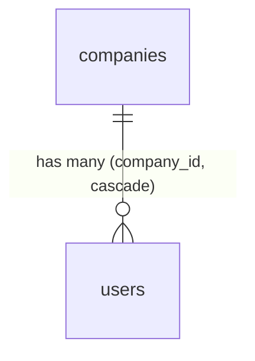

# Laravel Scaffold — Data Model

Three core tables, all ULID-keyed and soft-deleting. Verified against `database/migrations/0001_01_01_*`.

## companies

| Column | Type | Constraints | Notes |
|---|---|---|---|
| id | ulid | PK | |
| name | string | not null | |
| slug | string | not null, unique | |
| subscription_status | string | default `trial` | trial / active / suspended / cancelled |
| timezone | string | default `Europe/Amsterdam` | |
| locale | string(5) | default `en` | |
| currency | string(3) | default `EUR` | ISO 4217 |
| trial_ends_at | timestamp | nullable | |
| setup_completed_at | timestamp | nullable | setup-wizard flag |
| timestamps / deleted_at | | | soft deletes |

## users

| Column | Type | Constraints | Notes |
|---|---|---|---|
| id | ulid | PK | |
| company_id | foreignUlid | FK companies, cascadeOnDelete, indexed | the tenant scope key |
| first_name | string | not null | **not `name`** |
| last_name | string | not null | |
| email | string | not null | unique **per company** `(company_id, email)` |
| password | string | not null | |
| two_factor_enabled | boolean | default false | |
| email_verified_at | timestamp | nullable | |
| email_deliverable | boolean | default true | bounce flag ([[../email-setup/_module|email]]) |
| last_login_at | timestamp | nullable | |
| remember_token / timestamps / deleted_at | | | |

> Same migration also creates `password_reset_tokens` and `sessions`.

> [!note] Corrected from flat spec
> Flat spec marked `(company_id, email)` unique and the `first_name`/`last_name` split as *(assumed)*. Both are concrete in the migration — assumption markers removed.

## admins

FlowFlex staff — separate `admin` guard, NOT company-scoped. `id` (ulid PK), `name`, `email` (unique), `password`, `role` (super_admin / support / billing / developer), two-factor columns (added `2026_06_11`), timestamps, soft deletes.

## Related

- [[_module|Laravel Scaffold]]
- [[../../../security/tenancy-isolation]]
- [[../../../architecture/data-model]]
