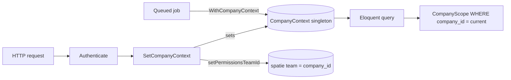

# Multi-Tenancy Layer

`foundation.tenancy` — shared-database multi-tenancy. Every query on every tenant model auto-filters by the current company. The single most security-critical module in the codebase.

## Components (verified in `app/Support` + `app/Http/Middleware`)

| Piece | File | Role |
|---|---|---|
| `CompanyContext` | `app/Support/Services/CompanyContext.php` | request/job-scoped current-company singleton |
| `CompanyScope` | `app/Support/Scopes/CompanyScope.php` | global scope auto-filtering `company_id` |
| `BelongsToCompany` | `app/Support/Traits/BelongsToCompany.php` | registers scope, auto-sets `company_id` on create, `company()` relation |
| `LogsCompanyActivity` | `app/Support/Scopes/LogsCompanyActivity.php` | tenant-scoped activity log |
| `SetCompanyContext` | `app/Http/Middleware/SetCompanyContext.php` | sets context from `$user->company_id`; calls `setPermissionsTeamId()` |
| `SetCompanyContextFromToken` | `app/Http/Middleware/SetCompanyContextFromToken.php` | API/Sanctum equivalent |
| `WithCompanyContext` | queue middleware | restores context in Horizon workers from job's `company_id` |



> [!note] Context middleware is persistent
> In `AppPanelProvider`, the auth middleware stack runs with `isPersistent: true` so Livewire update POSTs re-run `SetCompanyContext` — without it, deferred tables/actions 403 (the null-team family, [[../../../architecture/patterns/tenant-context-pitfalls]]).

## Public API

- `CompanyContext::set(Company $company): void`
- `CompanyContext::current(): Company` — throws `MissingCompanyContextException` if unset
- `CompanyContext::currentId(): ?string`

Full implementation: [[../../../architecture/multi-tenancy]]. No DTOs / Filament / Permissions — infrastructure; middleware wired into panels by [[../filament-panels/_module|filament-panels]].

## Test Checklist (verified)

- [x] Tenant isolation: company A context returns zero company B rows (`tests/Feature/TenantIsolationTest.php`)
- [x] `creating` hook auto-fills `company_id`
- [x] `current()` without context throws `MissingCompanyContextException`
- [x] `WithCompanyContext` restores context + team id in a queued job (`tests/Feature/QueueContextTest.php`)
- [x] Arch test forbids `withoutGlobalScope(CompanyScope)` outside admin/support (`tests/Architecture/TenancyTest.php`)

## Build Manifest

```
app/Support/Services/CompanyContext.php
app/Support/Scopes/CompanyScope.php
app/Support/Traits/BelongsToCompany.php
app/Http/Middleware/SetCompanyContext.php
app/Http/Middleware/SetCompanyContextFromToken.php
app/Support/Jobs/Middleware/WithCompanyContext.php
app/Exceptions/MissingCompanyContextException.php
tests/Feature/TenantIsolationTest.php · tests/Feature/QueueContextTest.php
tests/Architecture/TenancyTest.php
```

## Related

- [[../../../security/tenancy-isolation]] — isolation threat model
- [[../../../architecture/multi-tenancy]]
- [[../../../architecture/patterns/belongs-to-company]]
- [[../../../architecture/patterns/tenant-context-pitfalls]]
- [[../filament-panels/_module|Filament Panels]] · [[../queue-workers/_module|Queue Workers]]
- [[../../../glossary]]
