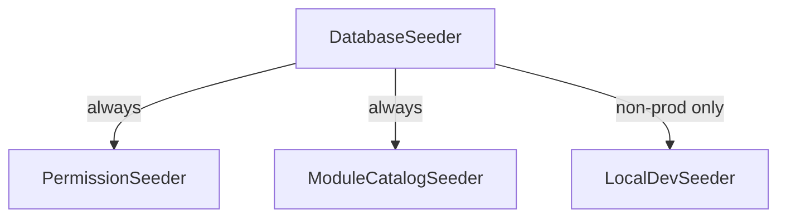

# Permissions Seeder

`foundation.permissions` — creates permission strings, the module catalog, and (non-prod) demo data on install. Idempotent.

## Seeder chain (verified in `database/seeders/`)



`DatabaseSeeder::run()` calls `PermissionSeeder` + `ModuleCatalogSeeder` unconditionally; `LocalDevSeeder` only when `! app()->environment('production')`.

> [!note] Corrected from flat spec
> - `PermissionSeeder` now seeds **CORE permissions only** (`core.settings.*`, `core.rbac.*`, …) via the `PERMISSIONS` const + `permission:cache-reset`. Domain perms (`access.*-panel`, `hr.*`, `finance.*`, `crm.*`) were **stripped with their domains** and return when rebuilt.
> - Demo accounts come from a single **`LocalDevSeeder`** — there is no `LocalAdminSeeder`/`LocalCompanySeeder`.

## Demo accounts (LocalDevSeeder, verified)

| Login | Password | Identity |
|---|---|---|
| `admin@flowflex.nl` | `password` | staff admin (`super_admin`) |
| `test@test.nl` | `test1234` | **both** staff admin (super_admin) **and** tenant owner of FlowFlex Demo — the real working login |
| `demo@flowflex.nl` | `password` | FlowFlex Demo owner (`owner` role) |

Also seeds: the "FlowFlex Demo" company (active, setup complete), the `owner` role synced to every `web`-guard permission, free core modules, all catalog modules active (billing rows only — domain UIs rebuilt later), 5 demo users, and 3 months of billing history. Refuses to run in production (`RuntimeException`).

## Owner permission sync

`$owner->syncPermissions(Permission::where('guard_name','web')->get())` — owners auto-receive any newly seeded permission without manual re-grant.

## Test Checklist (verified)

- [x] `PermissionSeeder` idempotent (`tests/Feature/SeederTest.php`)
- [x] Owner role has every permission after seed
- [x] `LocalDevSeeder` refuses to run in production
- [x] `migrate --seed` from empty DB clean (M0 gate)

## Build Manifest

```
database/seeders/DatabaseSeeder.php
database/seeders/PermissionSeeder.php
database/seeders/ModuleCatalogSeeder.php
database/seeders/LocalDevSeeder.php
tests/Feature/SeederTest.php
```

## Related

- [[../../../infrastructure/module-catalog]]
- [[../../../security/authn-authz]]
- [[../filament-panels/_module|Filament Panels]] · [[../multi-tenancy-layer/_module|Multi-Tenancy Layer]]
- [[../../../glossary]]
