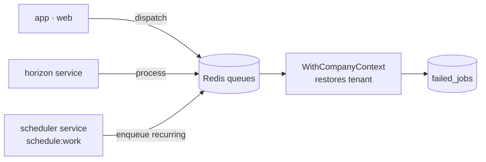

# Queue Workers & Scheduler

`foundation.queues` — Horizon, Redis queues, the `WithCompanyContext` job middleware wiring, and the scheduled-command runner. Background processing every domain depends on. Authoritative infra config: [[../../../infrastructure/queue-horizon]].

## Module-key

`foundation.queues`

**Priority:** v1-core (M0)  
**Panel:** `/horizon` (admin-guard — external Laravel Horizon dashboard, not a Filament panel)  
**Permission prefix:** none (Horizon access is guard-based — `admin` — not a permission string)  
**Tables:** `jobs`, `failed_jobs`, `job_batches` (Laravel-standard)

## Dependencies

| Type | Module | Why |
|---|---|---|
| Hard | [[../laravel-scaffold/_module\|foundation.scaffold]] | Redis / queue config from the skeleton |
| Hard | [[../multi-tenancy-layer/_module\|foundation.tenancy]] | `WithCompanyContext` restores the tenant in workers |

## Core Features

- Horizon `defaults` supervisor processes queues in priority order: `domain-events, notifications, hr, finance, webhooks, exports, imports, default` — see [[./features/job-processing|Job Processing]]
- `hr` / `finance` queues declared-but-empty until those domains return
- Dedicated `scheduler` service (`schedule:work`) enqueues recurring work — see [[./features/scheduled-commands|Scheduled Commands]]
- `WithCompanyContext` mandatory on any job touching tenant models
- Every scheduled command: `withoutOverlapping()` + `onOneServer()`
- `/horizon` dashboard gated to the `admin` guard

## Queues (verified in `config/horizon.php`)

`defaults` supervisor processes, in priority order:

```
domain-events, notifications, hr, finance, webhooks, exports, imports, default
```

> [!note] `hr` and `finance` are empty queues
> These queue names predate the HR/Finance/CRM strip. The queues are still declared in Horizon config but **no jobs are dispatched to them until those domains are rebuilt**. Left in place so the strip didn't churn the supervisor config.

## Topology



- `horizon` and `scheduler` run as **separate Docker services** ([[../docker-environment/_module|docker]]); scheduler = `php artisan schedule:work`.
- `/horizon` dashboard gated to the `admin` guard.
- `WithCompanyContext` mandatory on any job touching tenant models.
- Every scheduled command: `withoutOverlapping()` + `onOneServer()` ([[../../../architecture/queue-jobs]]).

## Queue Tables

`jobs`, `failed_jobs` (30-day retention), `job_batches` — Laravel-standard, no custom tables.

## Test Checklist (verified)

- [ ] Tenant isolation: a job dispatched without `WithCompanyContext` must not read/write another company's rows — the null-tenant guard (arch/feature check)
- [ ] Module gating: n/a — `foundation.queues` is always-on platform infra, not a billable/gateable module
- [x] Queued listener with `WithCompanyContext` restores the right company (`tests/Feature/QueueContextTest.php`)
- [ ] Horizon dashboard inaccessible to tenant users (admin guard only)

No DTOs / Filament / Permissions — infrastructure.

## Build Manifest

```
config/horizon.php (supervisors, queue priorities)
config/queue.php (redis connection)
routes/console.php (scheduler registrations)
app/Providers/HorizonServiceProvider.php (admin-guard gate)
tests/Feature/QueueContextTest.php
```

## Related

- [[../../../infrastructure/queue-horizon]] — full Horizon config
- [[../../../architecture/queue-jobs]]
- [[../multi-tenancy-layer/_module|Multi-Tenancy Layer]] — WithCompanyContext
- [[../email-setup/_module|Email Setup]] — mail on the `notifications` queue
