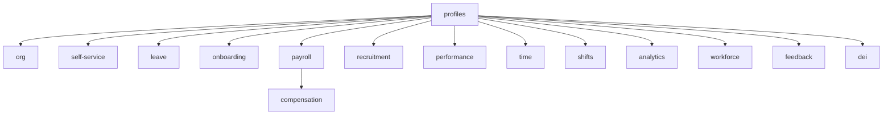

# HR & People

Complete employee lifecycle — hire to offboard. Leave management, payroll tracking, onboarding, performance, compensation, org chart, and workforce planning. **Panel:** `/hr` (Violet). Milestone M2 in [[build/ROADMAP]].

**Displaces**: BambooHR, Workday, HiBob, Personio

---

## Navigation Groups

- **Employees** — Profiles, Org Chart, Self-Service, Onboarding, Recruitment
- **Leave** — Leave Management, Time & Attendance, Shift Scheduling
- **Payroll** — Payroll, Compensation & Benefits
- **Performance** — Performance Reviews, Employee Feedback
- **Analytics** — HR Analytics, Workforce Planning, DEI Metrics

---

## Modules

| Module | Key | Status | Priority | Depends on (intra-domain) |
|---|---|---|---|---|
| [[domains/hr/employee-profiles\|Employee Profiles]] | `hr.profiles` | planned | v1-core | — (anchor) |
| [[domains/hr/leave-management\|Leave Management]] | `hr.leave` | planned | v1-core | profiles |
| [[domains/hr/onboarding\|Onboarding]] | `hr.onboarding` | planned | v1-core | profiles |
| [[domains/hr/payroll\|Payroll]] | `hr.payroll` | planned | v1-core | profiles |
| [[domains/hr/org-chart\|Org Chart]] | `hr.org` | planned | v1 | profiles |
| [[domains/hr/employee-self-service\|Employee Self-Service]] | `hr.self-service` | planned | v1 | profiles |
| [[domains/hr/recruitment\|Recruitment]] | `hr.recruitment` | planned | v1 | profiles |
| [[domains/hr/performance-reviews\|Performance Reviews]] | `hr.performance` | planned | v1 | profiles |
| [[domains/hr/time-attendance\|Time & Attendance]] | `hr.time` | planned | v1 | profiles |
| [[domains/hr/shift-scheduling\|Shift Scheduling]] | `hr.shifts` | planned | v1 | profiles |
| [[domains/hr/compensation-benefits\|Compensation & Benefits]] | `hr.compensation` | planned | v1 | profiles, payroll |
| [[domains/hr/hr-analytics\|HR Analytics]] | `hr.analytics` | planned | v1 | profiles |
| [[domains/hr/workforce-planning\|Workforce Planning]] | `hr.workforce` | planned | v1 | profiles |
| [[domains/hr/employee-feedback\|Employee Feedback]] | `hr.feedback` | planned | v1 | profiles |
| [[domains/hr/dei-metrics\|DEI Metrics]] | `hr.dei` | planned | v1 | profiles |

Build order: profiles → org → self-service → leave → onboarding → payroll → rest ([[build/BUILD-ORDER]]).

## Dependency Graph (intra-domain)



## Cross-Domain Edges

| Direction | Event | Counterpart |
|---|---|---|
| Fires | `EmployeeHired`, `EmployeeOffboarded` (profiles) | payroll stub/final pay, onboarding plan, IT (P3) |
| Fires | `LeaveRequestApproved` (leave) | payroll deductions, shift blocking |
| Fires | `TimesheetApproved` (time) | payroll hourly pay |
| Fires | `PayrollRunApproved` (payroll) | finance.ledger journal entry |
| Consumes | `ExpenseApproved` (finance) | payroll reimbursement |

Payload contracts: [[architecture/event-bus]].

---

## Status Board (Dataview)

```dataview
TABLE module-key AS "Key", status AS "Status", priority AS "Priority"
FROM "domains/hr"
WHERE type = "module"
SORT priority ASC, module-key ASC
```

---

## Key Patterns

- [[architecture/patterns/belongs-to-company]] — all HR models are tenant-scoped
- [[architecture/patterns/interface-service]] — `EmployeeService`, `LeaveService`, `PayrollService`
- [[architecture/patterns/encryption]] — national ID, DOB, salary, IBAN, DEI attributes
- [[architecture/packages]] — `spatie/laravel-model-states`, `saade/filament-fullcalendar`

---

## Panel Dashboard (2026-06-12)

/hr dashboard widgets shipped: HrStatsWidget (headcount, on leave today, pending leave, open roles), HeadcountChartWidget (12-month line, PHP date grouping), PendingLeaveWidget (approval queue table).
