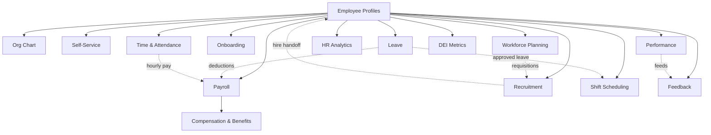

# HR & People — Domain MOC

Complete employee lifecycle — hire to offboard: profiles, org chart, self-service, onboarding, recruitment, leave, time & attendance, shift scheduling, payroll, compensation & benefits, performance, feedback, analytics, workforce planning, DEI. **Panel:** `/hr` (violet). Milestone M2 in [[../../build/ROADMAP]].

**Displaces:** BambooHR, Workday, HiBob, Personio.

> [!warning] Rebuild blueprint — nothing built
> The HR domain code was **stripped** back to the App + Admin shell (see [[../../decisions/decision-2026-06-19-strip-to-app-admin-shell]]). Every module below is `build-status: planned`. These specs are the **source of truth** for the rebuild — no code exists to verify against. Any earlier "shipped/complete" wording has been softened to intended tense.

Related stack: [[../../infrastructure/_moc|Infrastructure]] · [[../../security/_moc|Security]] · [[../../architecture/event-bus|Event Bus]] · [[../../glossary|Glossary]] · [[_opportunities|Opportunity Radar]].

---

## Navigation Groups

- **Employees** — Profiles, Org Chart, Self-Service, Onboarding, Recruitment
- **Leave** — Leave Management, Time & Attendance, Shift Scheduling
- **Payroll** — Payroll, Compensation & Benefits
- **Performance** — Performance Reviews, Employee Feedback
- **Analytics** — HR Analytics, Workforce Planning, DEI Metrics

---

## Modules

| Module | Key | Priority | Build status | Depends on (intra-domain) |
|---|---|---|---|---|
| [[employee-profiles/_module\|Employee Profiles]] | `hr.profiles` | v1-core | planned | — (anchor) |
| [[leave-management/_module\|Leave Management]] | `hr.leave` | v1-core | planned | profiles |
| [[onboarding/_module\|Onboarding]] | `hr.onboarding` | v1-core | planned | profiles |
| [[payroll/_module\|Payroll]] | `hr.payroll` | v1-core | planned | profiles |
| [[org-chart/_module\|Org Chart]] | `hr.org` | v1 | planned | profiles |
| [[employee-self-service/_module\|Employee Self-Service]] | `hr.self-service` | v1 | planned | profiles |
| [[recruitment/_module\|Recruitment]] | `hr.recruitment` | v1 | planned | profiles |
| [[performance-reviews/_module\|Performance Reviews]] | `hr.performance` | v1 | planned | profiles |
| [[time-attendance/_module\|Time & Attendance]] | `hr.time` | v1 | planned | profiles |
| [[shift-scheduling/_module\|Shift Scheduling]] | `hr.shifts` | v1 | planned | profiles |
| [[compensation-benefits/_module\|Compensation & Benefits]] | `hr.compensation` | v1 | planned | profiles, payroll |
| [[hr-analytics/_module\|HR Analytics]] | `hr.analytics` | v1 | planned | profiles |
| [[workforce-planning/_module\|Workforce Planning]] | `hr.workforce` | v1 | planned | profiles |
| [[employee-feedback/_module\|Employee Feedback]] | `hr.feedback` | v1 | planned | profiles |
| [[dei-metrics/_module\|DEI Metrics]] | `hr.dei` | v1 | planned | profiles |

Build order: profiles → org → self-service → leave → onboarding → payroll → rest ([[../../build/BUILD-ORDER]]).

---

## Dependency Graph (intra-domain)

_Solid = hard intra-domain dependency; dashed = event/soft integration._

---

## Cross-Domain Edges

| Direction | Event | Counterpart |
|---|---|---|
| Fires | `EmployeeHired`, `EmployeeOffboarded` (profiles) | payroll stub/final pay, onboarding plan, IT provisioning (P3) |
| Fires | `LeaveRequestApproved` (leave) | payroll deductions, shift blocking |
| Fires | `TimesheetApproved` (time) | payroll hourly pay |
| Fires | `PayrollRunApproved` (payroll) | finance.ledger journal entry |
| Consumes | `ExpenseApproved` (finance) | payroll reimbursement |

Payload contracts: [[../../architecture/event-bus]].

---

## Key Patterns

- [[../../architecture/patterns/belongs-to-company]] — all HR models are tenant-scoped
- [[../../architecture/patterns/interface-service]] — `EmployeeService`, `LeaveService`, `PayrollService`
- [[../../architecture/patterns/states]] — employee, leave, timesheet, review, payroll-run state machines
- [[../../security/encryption]] — national ID, DOB, salary, IBAN, DEI attributes
- [[../../architecture/packages]] — `spatie/laravel-model-states`, `saade/filament-fullcalendar`, `brick/money`
