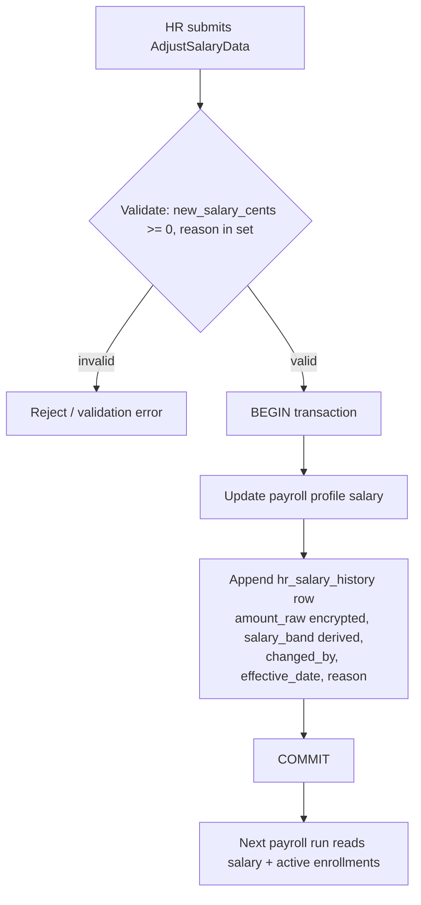

# Architecture — Compensation & Benefits

Planned Interface→Service binding per [[../../../architecture/patterns/interface-service]]: `CompensationServiceInterface` → `CompensationService`.

## Services & Actions (intended)

- `adjustSalary(AdjustSalaryData $data): void` — updates payroll profile salary **and** appends an `hr_salary_history` row in a single transaction.
- `bulkAdjust(array<AdjustSalaryData> $rows): BulkResult` — comp review cycle; per-row try/catch.
- `compaRatio(string $employeeId): ?float` — employee salary vs band midpoint; `null` when no matching band.
- `enroll(EnrollBenefitData $data)` / `unenroll(string $employeeBenefitId)` — benefit cost intended to reflect in next payroll run *(assumed: payroll reads active enrollments at run time)*.

## Money handling

Monetary amounts are integer minor units (cents, `bigint`). Compa-ratio and all arithmetic go through `brick/money` — never raw float math. See [[../../../architecture/packages]].

## Salary change flow (intended)

Salary changes are append-only into `hr_salary_history`; the flow updates payroll and writes history atomically.

## Related

- [[api]]
- [[data-model]]
- [[../../../architecture/patterns/interface-service]]
- [[../../../architecture/packages]]
