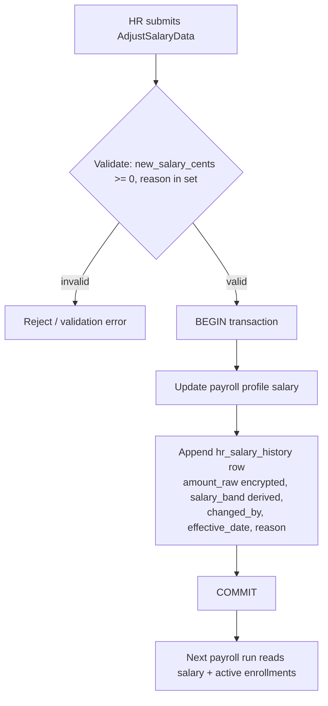

# Architecture — Compensation & Benefits

Planned Interface→Service binding per [[../../../architecture/patterns/interface-service]]: `CompensationServiceInterface` → `CompensationService`.

## Services & Actions (intended)

- `adjustSalary(AdjustSalaryData $data): void` — updates payroll profile salary **and** appends an `hr_salary_history` row in a single transaction.
- `bulkAdjust(array<AdjustSalaryData> $rows): BulkResult` — comp review cycle; per-row try/catch.
- `compaRatio(string $employeeId): ?float` — employee salary vs band midpoint; `null` when no matching band.
- `enroll(EnrollBenefitData $data)` / `unenroll(string $employeeBenefitId)` — benefit cost intended to reflect in next payroll run *(assumed: payroll reads active enrollments at run time)*.

## Money handling

Monetary amounts are integer minor units (cents, `bigint`). Compa-ratio and all arithmetic go through `brick/money` — never raw float math. See [[../../../architecture/packages]].

## Salary change flow (intended)

Salary changes are append-only into `hr_salary_history`; the flow updates payroll and writes history atomically.

## Filament Artifacts

**Nav group:** Payroll

| Artifact | Kind ([[../../../architecture/ui-strategy]] row) | Blueprint / Tweaks | Notes |
|---|---|---|---|
| `CompensationBandResource` | #1 CRUD resource | tweaks: none | list filters: department, job grade; min ≤ mid ≤ max validated on the form |
| `BenefitResource` | #1 CRUD resource | tweaks: none | catalog CRUD; type filter (insurance / pension / allowance) |
| `BenefitEnrollmentResource` | #1 CRUD resource | tweaks: custom-header-actions (unenroll) | enroll = create; unenroll sets `unenrolled_at`; filters: employee, benefit, active |
| `AdjustSalaryAction` | #1 resource action (custom-header-action) | tweaks: custom-header-actions (adjust-salary) | modal on the employee/band view; writes payroll profile + `hr_salary_history` atomically; `panel-action` rate limiter (money mutation) |
| `CompReviewPage` *(assumed)* | #7 wizard custom page | [[../../../architecture/patterns/page-blueprints#Wizard]] | bulk annual comp adjustment; per-row `bulkAdjust`; `panel-action` rate limiter (money mutation) |
| `SalaryHistoryRelationManager` | #2 relation manager | tweaks: read-only-flow-owned (owned by `CompensationService`), relation-manager-timeline | append-only trail rendered as a timeline tab; read-only; additionally gated on `hr.payroll.view-sensitive` |

**Access contract (mandatory):** every artifact gates on
`canAccess() = Auth::user()->can('hr.compensation.view-any') && BillingService::hasModule('hr.compensation')`
per [[../../../architecture/filament-patterns]] #1. `CompReviewPage` is a custom page and MUST state this
explicitly — Filament does not auto-gate custom pages. Salary display (`SalaryHistoryRelationManager`, salary
columns) is additionally gated on `hr.payroll.view-sensitive` ([[security]]). No public/portal surface — this is a
backend HR module.

## Concurrency

| Write path | Tier | Mechanism |
|---|---|---|
| Band / Benefit / Enrollment CRUD (form, API) | Optimistic | `updated_at` stale-check on save → `StaleRecordException` → conflict notification ([[../../../architecture/patterns/optimistic-locking]]) |
| `adjustSalary` (payroll profile + salary-history append) | Pessimistic | `DB::transaction()` + `lockForUpdate()` on the payroll profile, re-read, validate, write — money mutation per [[../../../architecture/patterns/states]] |
| `bulkAdjust` (comp review cycle) | Pessimistic | per-row `lockForUpdate()` in transaction; per-row try/catch so one failure does not roll back the batch |
| Benefit enroll / unenroll | Pessimistic | `lockForUpdate()` on the active-enrollment check to honour the unique-active `(employee_id, benefit_id)` constraint under concurrent enroll |
| `hr_salary_history` write | n/a | append-only — no updates/deletes, so no stale-write surface (the enclosing `adjustSalary` transaction owns concurrency) |

Tiers per [[../../../decisions/decision-2026-07-02-optimistic-locking-standard]].

## Related

- [[api]]
- [[data-model]]
- [[../../../architecture/patterns/interface-service]]
- [[../../../architecture/packages]]
