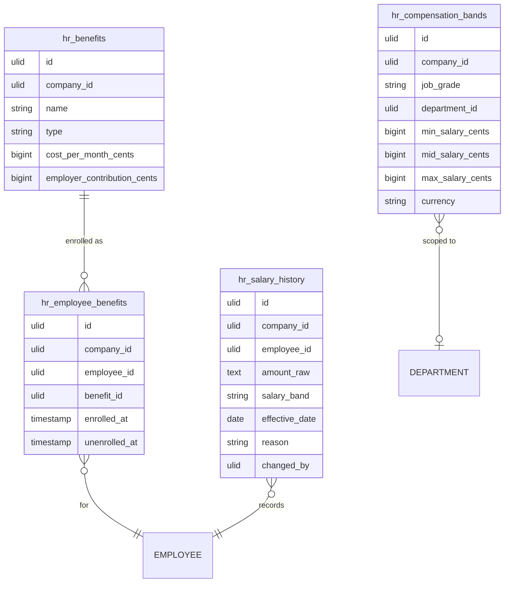

# Data Model — Compensation & Benefits

Four tables (planned). All carry `company_id` for tenant isolation — see [[../../../security/tenancy-isolation]] and [[../../../infrastructure/database]].

## hr_compensation_bands

| Column | Type | Notes |
|---|---|---|
| id, company_id (indexed) | ulid | |
| job_grade | string | unique `(company_id, job_grade, department_id)` |
| department_id | ulid nullable FK | null = company-wide |
| min_salary_cents / mid_salary_cents / max_salary_cents | bigint | min ≤ mid ≤ max |
| currency | string(3) | |
| deleted_at | timestamp nullable | |

## hr_benefits

| Column | Type | Notes |
|---|---|---|
| id, company_id (indexed) | ulid | |
| name | string | |
| type | string | insurance / pension / allowance |
| cost_per_month_cents | bigint | employee cost |
| employer_contribution_cents | bigint | |
| deleted_at | timestamp nullable | |

## hr_employee_benefits

| Column | Type | Notes |
|---|---|---|
| id, company_id, employee_id FK, benefit_id FK | ulid | unique active `(employee_id, benefit_id)` where `unenrolled_at` null |
| enrolled_at | timestamp | |
| unenrolled_at | timestamp nullable | |

## hr_salary_history

Append-only trail. No update/delete.

| Column | Type | Notes |
|---|---|---|
| id, company_id (indexed), employee_id FK | ulid | |
| 🔐 amount_raw | text | encrypted integer cents (new salary) — see [[security]] |
| salary_band | string | derived coarse band |
| effective_date | date | |
| reason | string | hire / promotion / comp-review / correction |
| changed_by | ulid FK users | |
| created_at | timestamp | append-only — no update/delete |

## ERD

Note: `EMPLOYEE` and `DEPARTMENT` are owned by [[../employee-profiles/_module]].

## Related

- [[../../../infrastructure/database]]
- [[../../../security/tenancy-isolation]]
- [[architecture]]
