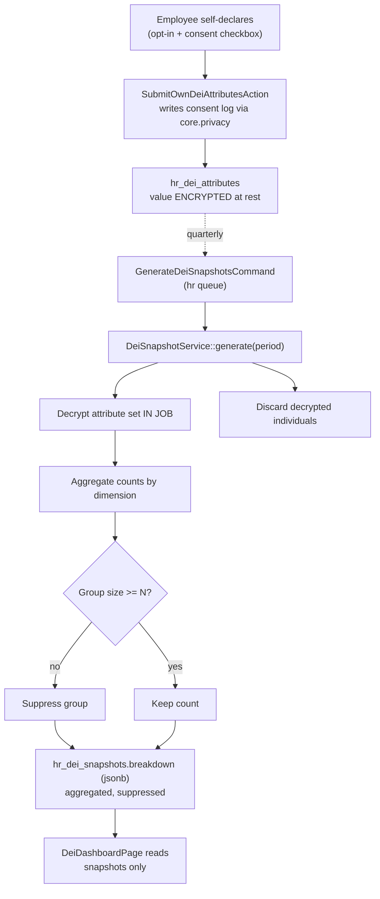

# DEI Metrics — Architecture

Intended service/action layout and the anonymized snapshot pipeline. See [[_module]].

## Services & Actions

| Class | Responsibility |
|---|---|
| `DeiSnapshotService::generate(string $period): void` | Decrypts the attribute set **inside a job**, aggregates, suppresses groups < N, stores the snapshot, discards individuals |
| `SubmitOwnDeiAttributesAction::run(SubmitDeiAttributesData $data): void` | Own-only submission; writes consent log |
| `WithdrawDeiConsentAction::run(): void` | Deletes own attributes + logs withdrawal |

## Jobs & Scheduling

Folded from the source spec's Jobs & Scheduling section.

| Job / Command | Queue | Schedule | Idempotency |
|---|---|---|---|
| `GenerateDeiSnapshotsCommand` | hr | quarterly | upsert per `(company, period, dimension)` |

Runs on the `hr` queue via [[../../../infrastructure/queue-horizon]]. Idempotent by upsert on `(company, period, dimension)` — safe to re-run a period.

## Snapshot Pipeline

Dashboards **never** live decrypt-and-group over individuals at request time — they read pre-computed snapshots. Withdrawal of consent deletes the source row before the next snapshot; already-stored snapshots hold aggregates only.

## Related

- [[data-model]]
- [[security]]
- [[../../../architecture/patterns/custom-pages]] (`DeiDashboardPage`)
- [[../../../architecture/patterns/encryption]]
- [[../../../infrastructure/queue-horizon]]
