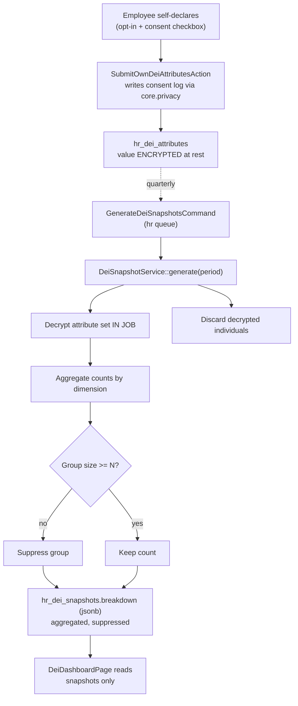

# DEI Metrics — Architecture

Intended service/action layout and the anonymized snapshot pipeline. See [[_module]].

## Services & Actions

| Class | Responsibility |
|---|---|
| `DeiSnapshotService::generate(string $period): void` | Decrypts the attribute set **inside a job**, aggregates, suppresses groups < N, stores the snapshot, discards individuals |
| `SubmitOwnDeiAttributesAction::run(SubmitDeiAttributesData $data): void` | Own-only submission; writes consent log |
| `WithdrawDeiConsentAction::run(): void` | Deletes own attributes + logs withdrawal |

## Jobs & Scheduling

Folded from the source spec's Jobs & Scheduling section.

| Job / Command | Queue | Schedule | Idempotency |
|---|---|---|---|
| `GenerateDeiSnapshotsCommand` | hr | quarterly | upsert per `(company, period, dimension)` |

Runs on the `hr` queue via [[../../../infrastructure/queue-horizon]]. Idempotent by upsert on `(company, period, dimension)` — safe to re-run a period.

## Snapshot Pipeline

Dashboards **never** live decrypt-and-group over individuals at request time — they read pre-computed snapshots. Withdrawal of consent deletes the source row before the next snapshot; already-stored snapshots hold aggregates only.

## Filament Artifacts

**Nav group:** Analytics

| Artifact | Kind ([[../../../architecture/ui-strategy]] row) | Blueprint / Tweaks | Notes |
|---|---|---|---|
| `DeiDashboardPage` | #6 Dashboard custom page | [[../../../architecture/patterns/page-blueprints#Dashboard]] | aggregate-only; reads `hr_dei_snapshots`, never live decrypt-and-group; groups below N render an "insufficient group size" placeholder; pay-equity section hidden without `hr.compensation`, hiring/promotion section hidden without `hr.recruitment` |

The opt-in declaration form + consent/withdrawal controls are contributed as a **DEI section on the `/app` employee self-service "My Profile" page** (owned by `hr.employee-self-service`), not a standalone `/hr` artifact — they invoke `SubmitOwnDeiAttributesAction` / `WithdrawDeiConsentAction` under `hr.dei.submit-own`. No public/portal surface — DEI data never leaves the module.

**Access contract (mandatory):** `DeiDashboardPage` is a custom page and MUST state it explicitly — Filament does not auto-gate custom pages:
`canAccess() = Auth::user()->can('hr.dei.view-dashboard') && BillingService::hasModule('hr.dei')`
per [[../../../architecture/filament-patterns]] #1. There is deliberately **no** `view-any` permission — individual attributes are never rendered, so no artifact exposes them ([[security]]). The self-service DEI section gates on `hr.dei.submit-own` (own record only).

## Concurrency

| Write path | Tier | Mechanism |
|---|---|---|
| DEI attribute self-declaration (`SubmitOwnDeiAttributesAction`) | Optimistic | upsert own row per unique `(employee_id, dimension)`; `updated_at` stale-check on re-declaration → `StaleRecordException` → conflict notification ([[../../../architecture/patterns/optimistic-locking]]) |
| Consent withdrawal (`WithdrawDeiConsentAction`, hard-delete own rows) | n/a | idempotent delete of the owner's own rows — no concurrent-write surface |
| Snapshot generation (`GenerateDeiSnapshotsCommand` / `DeiSnapshotService::generate`) | n/a | background job, single writer; idempotent upsert on `(company, period, dimension)` — safe to re-run a period |

Tiers per [[../../../decisions/decision-2026-07-02-optimistic-locking-standard]].

## Related

- [[data-model]]
- [[security]]
- [[../../../architecture/patterns/custom-pages]] (`DeiDashboardPage`)
- [[../../../architecture/patterns/encryption]]
- [[../../../infrastructure/queue-horizon]]
