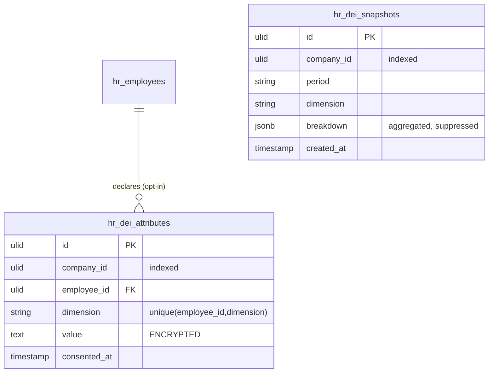

# DEI Metrics — Data Model

Two tables. Individual attributes are encrypted and never aggregated at request time; snapshots hold suppressed aggregates only. See [[_module]] and [[security]].

## hr_dei_attributes

| Column | Type | Notes |
|---|---|---|
| id | ulid | |
| company_id | ulid | indexed |
| employee_id | ulid FK | unique `(employee_id, dimension)` |
| dimension | string | gender / age-band / ethnicity / disability |
| 🔐 value | text | **encrypted** — never indexed, never filtered in SQL |
| consented_at | timestamp | consent log reference in core.privacy |

GDPR: hard-deleted on employee erasure; withdrawal of consent deletes the row.

## hr_dei_snapshots

| Column | Type | Notes |
|---|---|---|
| id | ulid | |
| company_id | ulid | indexed |
| period | string | e.g. `2026-Q2` |
| dimension | string | |
| breakdown | jsonb | AGGREGATED counts only, groups < N suppressed before storage |
| created_at | timestamp | |

Dashboards read snapshots only — never live decrypt-and-group over individuals at request time.

## ERD

No FK links `hr_dei_snapshots` back to individuals by design — snapshots are a one-way aggregate sink.

## Related

- [[../../../infrastructure/database]]
- [[../../../architecture/patterns/encryption]]
- [[security]]
