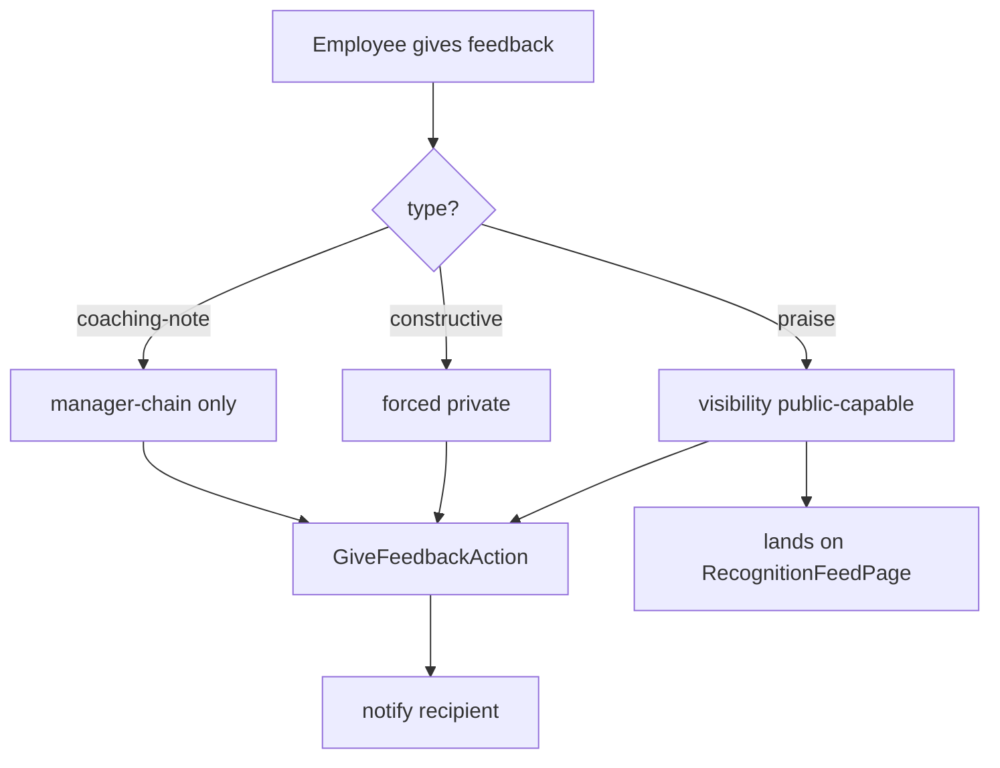

# Employee Feedback — Architecture

Intended design. Nothing built yet.

## Actions (simple ops)

- `GiveFeedbackAction::run(GiveFeedbackData $data): Feedback` — notifies recipient; public praise also lands on the recognition feed.
- `RequestFeedbackAction::run(string $fromEmployeeId): void` — notification asking for feedback.
- `LogOneOnOneAction::run(LogOneOnOneData $data): OneOnOne`.

Visibility rules are intended to be enforced in Eloquent query scopes (see [[security]]).

## Custom Pages ([[../../../architecture/patterns/custom-pages]])

- `RecognitionFeedPage` — public praise wall, polling every 60s (feed-style page, ui-strategy row #3).

Standard CRUD resources (`FeedbackResource`, `OneOnOneResource`) are visibility-scoped Filament resources (row #1).

## Give-Feedback Flow

