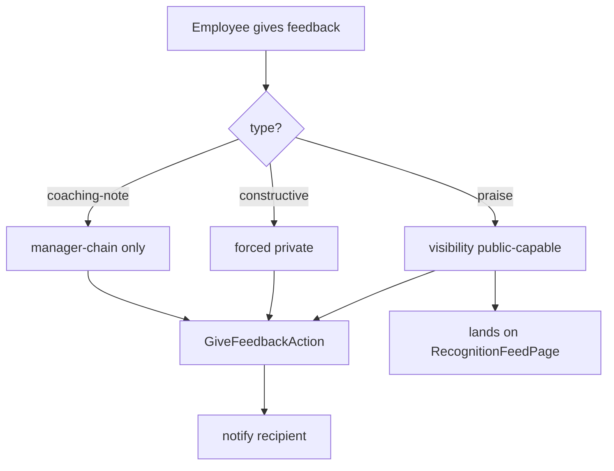

# Employee Feedback — Architecture

Intended design. Nothing built yet.

## Actions (simple ops)

- `GiveFeedbackAction::run(GiveFeedbackData $data): Feedback` — notifies recipient; public praise also lands on the recognition feed.
- `RequestFeedbackAction::run(string $fromEmployeeId): void` — notification asking for feedback.
- `LogOneOnOneAction::run(LogOneOnOneData $data): OneOnOne`.

Visibility rules are intended to be enforced in Eloquent query scopes (see [[security]]).

## Filament Artifacts

**Nav group:** Performance

| Artifact | Kind ([[../../../architecture/ui-strategy]] row) | Blueprint / Tweaks | Notes |
|---|---|---|---|
| `FeedbackResource` | #1 CRUD resource | tweaks: custom-header-actions (give-feedback — `hr.feedback.give`; request-feedback — comms, rate-limited) | visibility-scoped list (praise/constructive/coaching); give form forces visibility by type; tags via `spatie/laravel-tags` ([[features/feedback]], [[features/feedback-requests]]) |
| `OneOnOneResource` | #1 CRUD resource | tweaks: *(none — participant-scoped list + action-item checklist)* | participant-only confidentiality enforced in query scope ([[features/one-on-ones]]) |
| `RecognitionFeedPage` | #17 Gallery / directory grid custom page | [[../../../architecture/patterns/page-blueprints#Gallery / Directory Grid]] | public-praise card wall; polling 60s (justified override of the row-#17 "None" default — new praise should appear without manual refresh) ([[features/recognition-feed]]) |

Visibility rules are enforced in Eloquent query scopes, not just the UI (see [[security]]).

> **Kind correction:** the earlier draft cited ui-strategy row #3 (Kanban) for `RecognitionFeedPage`; a chronological praise wall is a card grid, so it maps to row #17 (Gallery / Directory Grid). No Kanban columns/drag exist here. *(assumed — flagged for confirmation.)*

**Access contract (mandatory):** every artifact gates on
`canAccess() = Auth::user()->can('hr.feedback.view-any') && BillingService::hasModule('hr.feedback')`
per [[../../../architecture/filament-patterns]] #1. `RecognitionFeedPage` is a custom page and MUST state it explicitly — Filament does not auto-gate custom pages. `FeedbackResource`/`OneOnOneResource` additionally scope rows by the visibility/confidentiality matrix in [[security]] (own vs HR `view-any` vs participant-only). Give/request actions require `hr.feedback.give`; 1-on-1 records require `hr.feedback.one-on-one`. No public/portal surface.

## Give-Feedback Flow

## Concurrency

| Write path | Tier | Mechanism |
|---|---|---|
| Give feedback (`GiveFeedbackAction`) | n/a | append-only insert of an immutable feedback record — no concurrent mutation of an existing row |
| Feedback request (`RequestFeedbackAction`) | n/a | fire-and-notify; no persisted mutable row |
| 1-on-1 record CRUD (agenda / notes / action items) | Optimistic | `updated_at` stale-check on save → `StaleRecordException` → conflict notification ([[../../../architecture/patterns/optimistic-locking]]) |
| Recognition feed | n/a | read-only view over public `hr_feedback` |

Tiers per [[../../../decisions/decision-2026-07-02-optimistic-locking-standard]].
