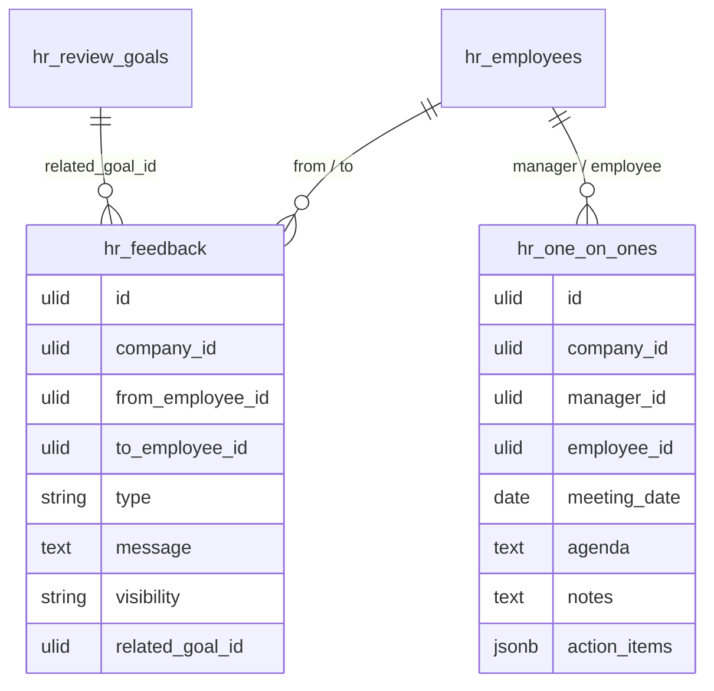

# Employee Feedback — Data Model

Intended schema. See [[../../../infrastructure/database]] and [[../../../security/tenancy-isolation]].

## hr_feedback

| Column | Type | Notes |
|---|---|---|
| id, company_id (indexed) | ulid | |
| from_employee_id / to_employee_id | ulid FK | from ≠ to |
| type | string | praise / constructive / coaching-note |
| message | text | plain text *(assumed — no rich text)* |
| visibility | string | public / private — forced: praise=public-capable, constructive=private, coaching-note=manager-chain *(assumed)* |
| related_goal_id | ulid nullable FK hr_review_goals | |
| deleted_at | timestamp nullable | |

**Indexes:** `(company_id, to_employee_id)`, `(company_id, visibility, created_at)` (feed).

## hr_one_on_ones

| Column | Type | Notes |
|---|---|---|
| id, company_id (indexed) | ulid | |
| manager_id / employee_id | ulid FK | |
| meeting_date | date | |
| agenda / notes | text nullable | visible to the two participants only |
| action_items | jsonb | `[{title, done}]` |
| deleted_at | timestamp nullable | |

## ERD

