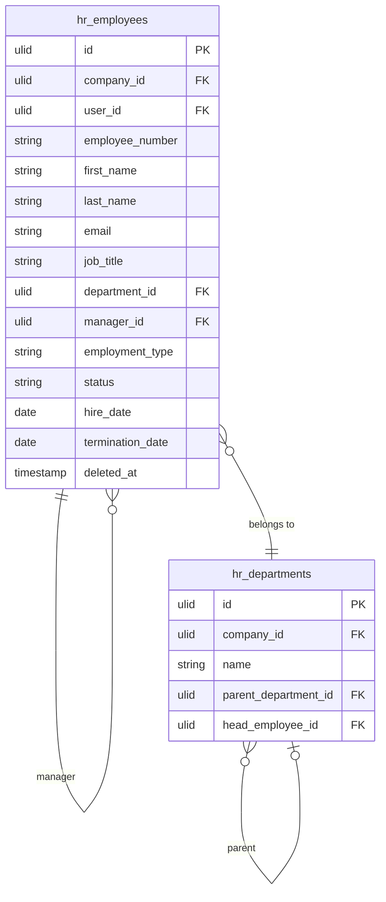

# Employee Profiles

Core employee record covering the full employment lifecycle: hire details, personal info, job position, department, manager, employment status, and termination. The anchor record that all other HR modules reference.

---

## Core Features

- Employee record: personal info, contact details, emergency contacts, national ID, work email
- Employment details: hire date, job title, department, manager (self-referential), employment type (full-time/part-time/contractor)
- Employment status machine: `active → on_leave | terminated | suspended` (via `spatie/laravel-model-states`)
- Document storage: employment contract, ID documents, certifications (via Media Library)
- Employee number: auto-generated per company, unique and sequential within company
- Profile photo upload
- Manager hierarchy: recursive `manager_id` FK on `hr_employees`
- Offboarding: termination date, reason, exit survey link, equipment checklist
- Direct reports list on employee profile
- Phone validation via `propaganistas/laravel-phone` — stored in E.164 format
- **Encrypted at rest**: `national_id`, `date_of_birth`, `personal_email` — see [[architecture/patterns/encryption]]

---

## Data Model

| Table | Key Columns |
|---|---|
| `hr_employees` | company_id, user_id (nullable FK to users), employee_number, first_name, last_name, email, phone, personal_email, date_of_birth, national_id, hire_date, termination_date, job_title, department_id, manager_id, employment_type, status, deleted_at |
| `hr_departments` | company_id, name, parent_department_id, head_employee_id |
| `hr_emergency_contacts` | employee_id, company_id, name, relationship, phone, email |

---

## Filament

**Nav group:** Employees

- `EmployeeResource` — list (searchable, filterable by dept/status/type), create, edit, view
- View page: profile card + tabs (Personal, Employment, Documents, History)
- `EmployeeProfileWidget` — stat widgets on list page (headcount, new hires this month, turnover rate)
- Export via `pxlrbt/filament-excel`

---

## Related

- [[domains/hr/org-chart]]
- [[domains/hr/leave-management]]
- [[domains/hr/payroll]]
- [[domains/hr/onboarding]]
