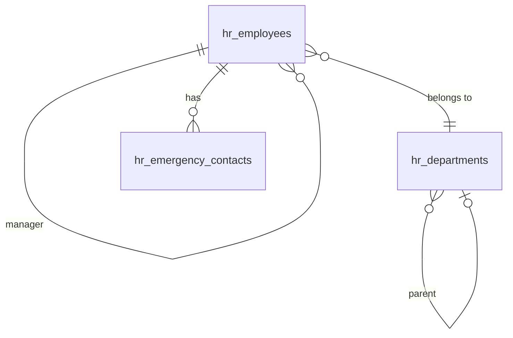

# Employee Profiles

Core employee record covering the full employment lifecycle: hire details, personal info, job position, department, manager, employment status, and termination. The anchor record that all other HR modules reference — build first in `/hr`.

---

## Dependencies

| Type | Module | Why |
|---|---|---|
| Hard | [[domains/core/billing-engine\|core.billing]] | module gating |
| Hard | [[domains/core/rbac\|core.rbac]] | permissions |
| Hard | [[domains/core/file-storage\|core.files]] | documents + profile photo via Media Library |
| Soft | [[domains/hr/org-chart\|hr.org]] | renders the manager hierarchy; without it, hierarchy exists data-only |
| Soft | [[domains/core/data-import\|core.import]] | bulk employee import; manual entry without it |

---

## Core Features

- Employee record: personal info, contact details, emergency contacts, national ID, work email
- Employment details: hire date, job title, department, manager (self-referential), employment type (full-time/part-time/contractor)
- Employment status machine: `active → on_leave | terminated | suspended` (via `spatie/laravel-model-states`)
- Document storage: employment contract, ID documents, certifications (via Media Library)
- Employee number: auto-generated per company, unique and sequential within company
- Profile photo upload
- Manager hierarchy: recursive `manager_id` FK on `hr_employees`
- Offboarding: termination date, reason, exit survey link, equipment checklist
- Direct reports list on employee profile
- Phone validation via `propaganistas/laravel-phone` — stored in E.164 format
- **Encrypted at rest**: `national_id`, `date_of_birth`, `personal_email` — see [[architecture/patterns/encryption]] (incl. `national_id_hash` for lookup, `birth_year` derived column for ranges)

---

## Data Model

### hr_employees

| Column | Type | Constraints | Notes |
|---|---|---|---|
| id | ulid | PK | |
| company_id | ulid | not null, FK companies, indexed | |
| user_id | ulid | nullable, FK users | null = no portal login |
| employee_number | string | not null | sequential per company; unique `(company_id, employee_number)` |
| first_name / last_name | string | not null | searchable |
| email | string | not null | work email; unique `(company_id, email)` |
| phone | string | nullable | E.164 |
| 🔐 personal_email | text | nullable | encrypted |
| 🔐 date_of_birth | text | nullable | encrypted; `birth_year` smallint derived *(assumed)* |
| 🔐 national_id | text | nullable | encrypted; `national_id_hash` text indexed |
| hire_date | date | not null | |
| termination_date | date | nullable | |
| termination_reason | text | nullable | *(assumed)* |
| job_title | string | not null | |
| department_id | ulid | nullable, FK hr_departments | |
| manager_id | ulid | nullable, FK hr_employees | self-referential |
| employment_type | string | not null | full-time / part-time / contractor |
| status | string | not null, default `active` | state machine |
| deleted_at | timestamp | nullable | |

**Indexes:** `(company_id, status)`, `(company_id, department_id)`, `(company_id, manager_id)`

### hr_departments

| Column | Type | Constraints |
|---|---|---|
| id, company_id (indexed) | ulid | |
| name | string | not null, unique `(company_id, name)` *(assumed)* |
| parent_department_id | ulid nullable FK self | |
| head_employee_id | ulid nullable FK hr_employees | |
| deleted_at | timestamp nullable | |

### hr_emergency_contacts

| Column | Type | Notes |
|---|---|---|
| id, company_id (indexed), employee_id FK | ulid | |
| name, relationship | string | |
| phone | string | E.164 |
| email | string nullable | |

GDPR: hard-deleted on employee erasure ([[architecture/data-lifecycle]]).



---

## State Machine

Column: `hr_employees.status` — `EmployeeState`.

| State | Transitions to | Triggered by (permission) | Side effects |
|---|---|---|---|
| `active` | `on_leave` | `hr.employees.update` (or auto from approved long leave *(assumed: manual v1)*) | |
| `active` | `suspended` | `hr.employees.update` | portal login disabled *(assumed)* |
| `active` | `terminated` | `hr.employees.offboard` | fires `EmployeeOffboarded`; termination fields required |
| `on_leave` / `suspended` | `active` | `hr.employees.update` | |
| `on_leave` / `suspended` | `terminated` | `hr.employees.offboard` | as above |

Initial: `active` (set on hire). Terminal: `terminated`. Transitions audited.

---

## DTOs

### CreateEmployeeData (input)
| Field | Type | Validation |
|---|---|---|
| first_name / last_name | string | required, max:100 |
| email | string | required, email, unique per company (`hr_employees`) |
| phone | ?string | nullable, `phone:AUTO` → E.164 |
| personal_email | ?string | nullable, email |
| date_of_birth | ?CarbonImmutable | nullable, date, before:today |
| national_id | ?string | nullable, max:50 |
| hire_date | CarbonImmutable | required, date |
| job_title | string | required, max:150 |
| department_id | ?string | nullable, ulid, exists in company |
| manager_id | ?string | nullable, ulid, exists in company, not self |
| employment_type | string | required, in:full-time,part-time,contractor |
| create_user_account | bool | default false — triggers invitation *(assumed)* |

Messages: "An employee with this email already exists in your company."
Cross-field: `manager_id` must not create a cycle (validated in service).

### OffboardEmployeeData (input)
| Field | Type | Validation |
|---|---|---|
| employee_id | string | required, ulid |
| termination_date | CarbonImmutable | required, on/after hire_date |
| termination_reason | string | required, max:1000 |

### EmployeeData (output)
id, employee_number, first_name, last_name, full_name, email, phone, job_title, department_id, department_name, manager_id, manager_name, employment_type, status, hire_date, termination_date, direct_report_count

---

## Services & Actions

Interface→Service: `EmployeeServiceInterface` → `EmployeeService`.

- `hire(CreateEmployeeData $data): EmployeeData` — assigns next employee_number (advisory lock per company *(assumed)*), fires `EmployeeHired`
- `update(string $employeeId, UpdateEmployeeData $data): EmployeeData` — throws `ManagerCycleException` on circular manager chain
- `offboard(OffboardEmployeeData $data): EmployeeData` — transition to terminated, fires `EmployeeOffboarded`
- `directReports(string $employeeId): Collection<EmployeeData>`
- `managerChain(string $employeeId): Collection<EmployeeData>` — for approval routing

---

## Events

### Fires: EmployeeHired
| Payload field | Type |
|---|---|
| company_id | string |
| employee_id | string |
| user_id | ?string |
| start_date | CarbonImmutable |
| job_title | string |

### Fires: EmployeeOffboarded
| Payload field | Type |
|---|---|
| company_id | string |
| employee_id | string |
| user_id | ?string |
| termination_date | CarbonImmutable |

Consumers per [[architecture/event-bus]] (payroll record stub, onboarding plan, IT provisioning P3; final pay + access revocation).

---

## Filament

**Nav group:** Employees

| Artifact | Kind ([[architecture/ui-strategy]] row) | Notes |
|---|---|---|
| `EmployeeResource` | #1 CRUD resource | searchable, filters: dept/status/type; export via pxlrbt/filament-excel |
| Employee view page | #2 detail with tabs | profile card + tabs: Personal, Employment, Documents (Media Library), History (activitylog) |
| `DepartmentResource` | #1 CRUD resource | tree via parent_department_id *(assumed: simple list v1)* |
| `OffboardAction` | modal action | termination form on view page |
| `EmployeeProfileWidget` | #6 widgets on list page | headcount, new hires this month, turnover rate |


**Access contract:** every artifact above gates on `canAccess() = Auth::user()->can('hr.employees.view-any') && BillingService::hasModule('hr.profiles')` per [[architecture/filament-patterns]] #1 — custom pages state it explicitly. Public/portal surfaces use a guest or scoped-portal guard (Vue+Inertia per [[architecture/ui-strategy]]).

**Security notes** (per [[build/security-audit-2026-06-11]]):

- **Rate limiter** (medium): Cite a throttle (e.g. RateLimiter 'hr-export' per-user/company) on the export action per architecture/security.md.

---

## Permissions

`hr.employees.view-any` · `hr.employees.view` · `hr.employees.create` · `hr.employees.update` · `hr.employees.delete` · `hr.employees.offboard` · `hr.employees.view-sensitive` *(assumed — gates encrypted field display)* · `hr.departments.manage`

---

## Search & Realtime

Meilisearch (Scout): first_name, last_name, email, job_title, employee_number. Never index encrypted fields. Realtime: none (CRUD default).

---

## Test Checklist

- [ ] Tenant isolation: company A employees invisible to company B
- [ ] Module gating: resources hidden when `hr.profiles` inactive
- [ ] Hire fires `EmployeeHired` with contract payload
- [ ] Offboard transitions state + fires `EmployeeOffboarded`, requires reason + date
- [ ] Employee numbers sequential + unique per company under concurrent creates
- [ ] Manager cycle rejected (`ManagerCycleException`)
- [ ] Encrypted fields stored as ciphertext (raw DB check), hash lookup works
- [ ] `view-sensitive` permission gates national_id/DOB display
- [ ] Phone normalised to E.164
- [ ] Duplicate work email per company rejected with message

---

## Build Manifest

```
database/migrations/xxxx_create_hr_departments_table.php
database/migrations/xxxx_create_hr_employees_table.php
database/migrations/xxxx_create_hr_emergency_contacts_table.php
app/Models/HR/{Employee,Department,EmergencyContact}.php
app/States/HR/Employee/{EmployeeState,Active,OnLeave,Suspended,Terminated}.php
app/Data/HR/{CreateEmployeeData,UpdateEmployeeData,OffboardEmployeeData,EmployeeData}.php
app/Contracts/HR/EmployeeServiceInterface.php
app/Services/HR/EmployeeService.php
app/Providers/HR/HRServiceProvider.php
app/Exceptions/HR/ManagerCycleException.php
app/Events/HR/{EmployeeHired,EmployeeOffboarded}.php
app/Filament/HR/Resources/{EmployeeResource,DepartmentResource}.php
app/Filament/HR/Widgets/EmployeeProfileWidget.php
database/factories/HR/{EmployeeFactory,DepartmentFactory,EmergencyContactFactory}.php
tests/Feature/HR/{EmployeeTest,EmployeeOffboardTest,EmployeeEncryptionTest}.php
```

---

## Related

- [[domains/hr/org-chart]]
- [[domains/hr/leave-management]]
- [[domains/hr/payroll]]
- [[domains/hr/onboarding]]
- [[architecture/event-bus]]
- [[architecture/patterns/encryption]]
