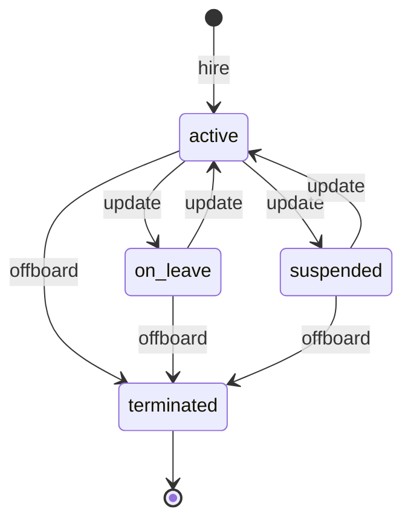
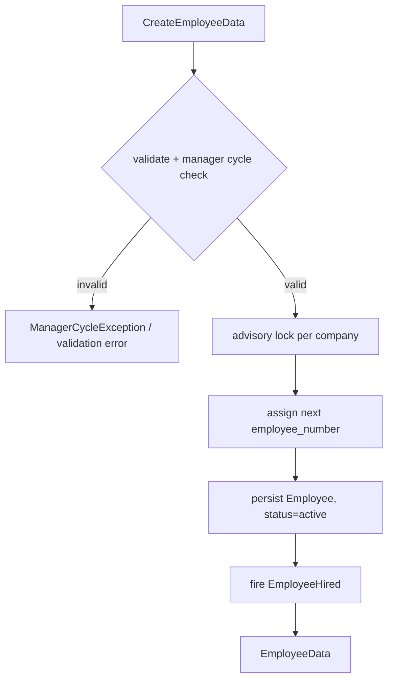

# Architecture — Employee Profiles

> Planned. See [[_module]]. Follows [[../../../architecture/patterns/interface-service]] and [[../../../architecture/patterns/states]].

## Intended Services & Actions

Interface→Service: `EmployeeServiceInterface` → `EmployeeService`.

| Method | Signature | Behavior |
|---|---|---|
| `hire` | `hire(CreateEmployeeData $data): EmployeeData` | Assigns next `employee_number` (advisory lock per company *(assumed)*), fires `EmployeeHired` |
| `update` | `update(string $employeeId, UpdateEmployeeData $data): EmployeeData` | Throws `ManagerCycleException` on circular manager chain |
| `offboard` | `offboard(OffboardEmployeeData $data): EmployeeData` | Transitions to `terminated`, fires `EmployeeOffboarded` |
| `directReports` | `directReports(string $employeeId): Collection<EmployeeData>` | Direct reports listing |
| `managerChain` | `managerChain(string $employeeId): Collection<EmployeeData>` | Upward chain for approval routing |

Exception: `ManagerCycleException` (in `app/Exceptions/HR/`).

## State Machine

Column `hr_employees.status` → `EmployeeState` (via `spatie/laravel-model-states`). Initial: `active` (on hire). Terminal: `terminated`. Transitions audited.

| State | Transitions to | Triggered by (permission) | Side effects |
|---|---|---|---|
| `active` | `on_leave` | `hr.employees.update` (or auto from approved long leave *(assumed: manual v1)*) | |
| `active` | `suspended` | `hr.employees.update` | portal login disabled *(assumed)* |
| `active` | `terminated` | `hr.employees.offboard` | fires `EmployeeOffboarded`; termination fields required |
| `on_leave` / `suspended` | `active` | `hr.employees.update` | |
| `on_leave` / `suspended` | `terminated` | `hr.employees.offboard` | as above |

## Hire Flow

## Related

- [[data-model]] · [[api]] · [[security]]
- [[../../../architecture/patterns/states]]
- [[../../../architecture/patterns/interface-service]]
