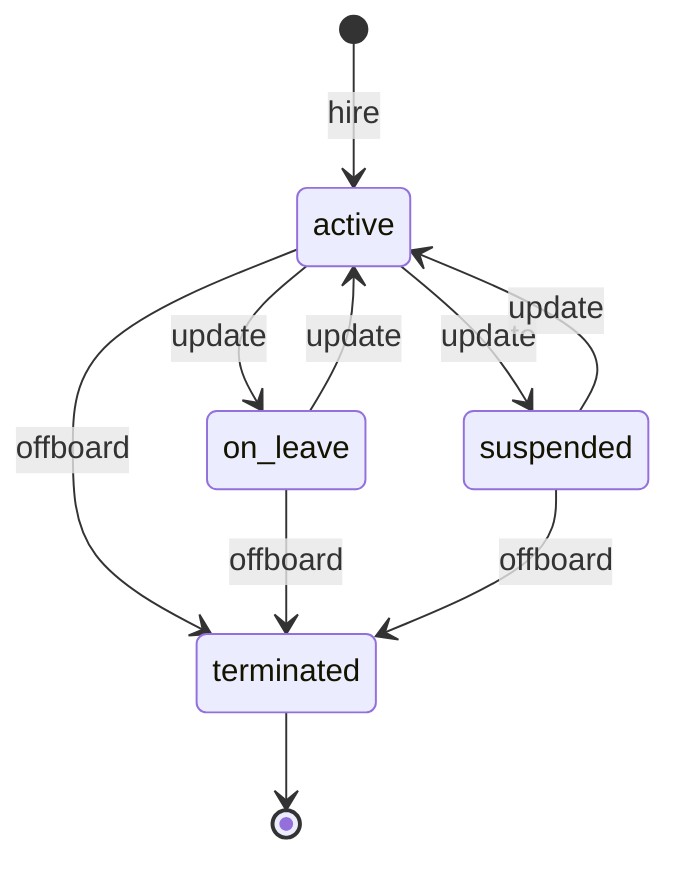
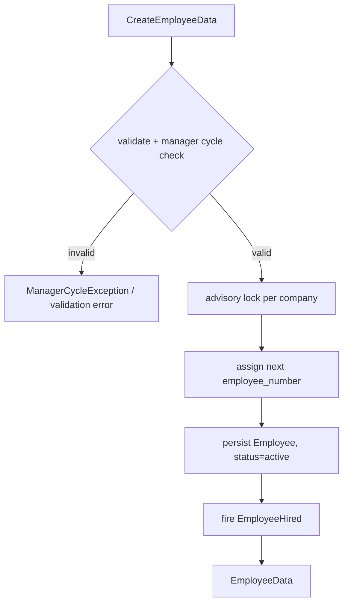

# Architecture — Employee Profiles

> Planned. See [[_module]]. Follows [[../../../architecture/patterns/interface-service]] and [[../../../architecture/patterns/states]].

## Intended Services & Actions

Interface→Service: `EmployeeServiceInterface` → `EmployeeService`.

| Method | Signature | Behavior |
|---|---|---|
| `hire` | `hire(CreateEmployeeData $data): EmployeeData` | Assigns next `employee_number` (advisory lock per company *(assumed)*), fires `EmployeeHired` |
| `update` | `update(string $employeeId, UpdateEmployeeData $data): EmployeeData` | Throws `ManagerCycleException` on circular manager chain |
| `offboard` | `offboard(OffboardEmployeeData $data): EmployeeData` | Transitions to `terminated`, fires `EmployeeOffboarded` |
| `directReports` | `directReports(string $employeeId): Collection<EmployeeData>` | Direct reports listing |
| `managerChain` | `managerChain(string $employeeId): Collection<EmployeeData>` | Upward chain for approval routing |

Exception: `ManagerCycleException` (in `app/Exceptions/HR/`).

## State Machine

Column `hr_employees.status` → `EmployeeState` (via `spatie/laravel-model-states`). Initial: `active` (on hire). Terminal: `terminated`. Transitions audited.

| State | Transitions to | Triggered by (permission) | Side effects |
|---|---|---|---|
| `active` | `on_leave` | `hr.employees.update` (or auto from approved long leave *(assumed: manual v1)*) | |
| `active` | `suspended` | `hr.employees.update` | portal login disabled *(assumed)* |
| `active` | `terminated` | `hr.employees.offboard` | fires `EmployeeOffboarded`; termination fields required |
| `on_leave` / `suspended` | `active` | `hr.employees.update` | |
| `on_leave` / `suspended` | `terminated` | `hr.employees.offboard` | as above |

## Hire Flow

## Filament Artifacts

**Nav group:** Employees

| Artifact | Kind ([[../../../architecture/ui-strategy]] row) | Blueprint / Tweaks | Notes |
|---|---|---|---|
| `EmployeeResource` | #1 CRUD resource | tweaks: view-page-tabs (Personal / Employment / Documents / History), state-badge-column (employment status + transition action group), custom-header-actions (offboard — own permission), relation-manager-timeline (History via activitylog) | list filters: dept / status / type; searchable name/email/title/number; export via pxlrbt/filament-excel (see [[security]] rate limiter) |
| `DepartmentResource` | #1 CRUD resource | tweaks: *(none v1 — simple list; tree via `parent_department_id` assumed later)* *(assumed)* | manage via `hr.departments.manage` |
| `OffboardAction` | header action on `EmployeeResource` view page — tweak `custom-header-actions` | [[../../../architecture/ui-strategy#Resource Tweak Taxonomy]] | termination form modal → `terminated`; own permission `hr.employees.offboard` |
| `EmployeeProfileWidget` | #6 dashboard widget | [[../../../architecture/patterns/page-blueprints#Dashboard]] | headcount, new hires this month, turnover rate; polling 30–60s |

**Access contract (mandatory):** every artifact gates on
`canAccess() = Auth::user()->can('hr.employees.view-any') && BillingService::hasModule('hr.profiles')`
per [[../../../architecture/filament-patterns]] #1. `OffboardAction` additionally requires `hr.employees.offboard`; sensitive-field display requires `hr.employees.view-sensitive` ([[security]]). No custom Page class in the Build Manifest — all surfaces are the resource, its view tabs, and the widget. The employee-facing surface is `hr.self-service` (Vue+Inertia per [[../../../architecture/ui-strategy]], scoped-portal guard), not a Filament artifact of this module.

## Concurrency

| Write path | Tier | Mechanism |
|---|---|---|
| Employee & department CRUD (form, API) | Optimistic | `updated_at` stale-check on save → `StaleRecordException` → conflict notification ([[../../../architecture/patterns/optimistic-locking]]) |
| Employee-number assignment on hire | Pessimistic | advisory lock per company + `lockForUpdate` re-read so sequential numbers stay unique under concurrent hires ([[../../../architecture/patterns/optimistic-locking]]) |
| Employment-status transition (on-leave / suspend / reactivate / offboard) | Pessimistic | `DB::transaction()` + `lockForUpdate()`, re-read, validate, write per [[../../../architecture/patterns/states]] |
| Manager reassignment (`manager_id`) | Optimistic | `updated_at` stale-check; cycle re-validated at write time (`ManagerCycleException`) ([[../../../architecture/patterns/optimistic-locking]]) |
| Document upload (Media Library) | n/a | append-only media rows; no shared-record mutation |

Tiers per [[../../../decisions/decision-2026-07-02-optimistic-locking-standard]].

## Related

- [[data-model]] · [[api]] · [[security]]
- [[../../../architecture/patterns/states]]
- [[../../../architecture/patterns/interface-service]]
