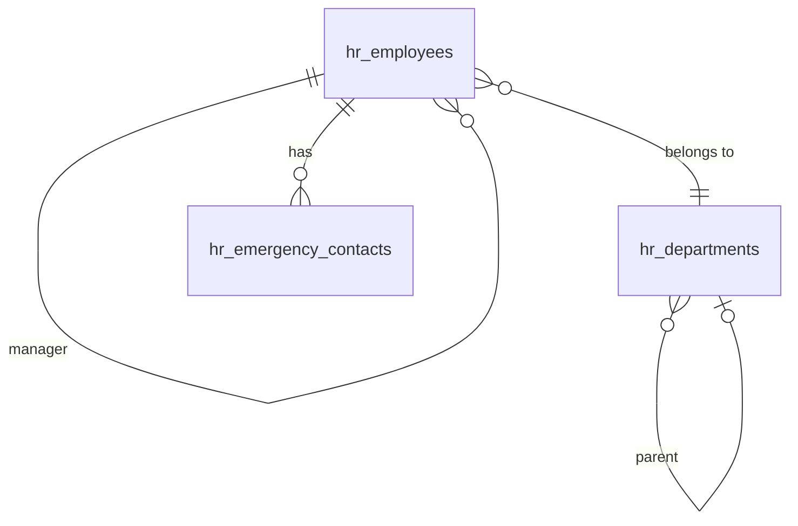

# Data Model — Employee Profiles

> Planned. Tables owned: `hr_employees`, `hr_departments`, `hr_emergency_contacts`. All `HasUlids` + `BelongsToCompany` + `SoftDeletes` per [[../../../architecture/patterns/belongs-to-company]]. See [[../../../infrastructure/database]]. Encrypted fields: see [[security]].

## hr_employees

| Column | Type | Constraints | Notes |
|---|---|---|---|
| id | ulid | PK | |
| company_id | ulid | not null, FK companies, indexed | |
| user_id | ulid | nullable, FK users | null = no portal login |
| employee_number | string | not null | sequential per company; unique `(company_id, employee_number)` |
| first_name / last_name | string | not null | searchable |
| email | string | not null | work email; unique `(company_id, email)` |
| phone | string | nullable | E.164 |
| 🔐 personal_email | text | nullable | encrypted |
| 🔐 date_of_birth | text | nullable | encrypted; `birth_year` smallint derived *(assumed)* |
| 🔐 national_id | text | nullable | encrypted; `national_id_hash` text indexed |
| hire_date | date | not null | |
| termination_date | date | nullable | |
| termination_reason | text | nullable | *(assumed)* |
| job_title | string | not null | |
| department_id | ulid | nullable, FK hr_departments | |
| manager_id | ulid | nullable, FK hr_employees | self-referential |
| employment_type | string | not null | full-time / part-time / contractor |
| status | string | not null, default `active` | state machine ([[architecture]]) |
| deleted_at | timestamp | nullable | |

**Indexes:** `(company_id, status)`, `(company_id, department_id)`, `(company_id, manager_id)`

## hr_departments

| Column | Type | Constraints |
|---|---|---|
| id, company_id (indexed) | ulid | |
| name | string | not null, unique `(company_id, name)` *(assumed)* |
| parent_department_id | ulid nullable FK self | |
| head_employee_id | ulid nullable FK hr_employees | |
| deleted_at | timestamp nullable | |

## hr_emergency_contacts

| Column | Type | Notes |
|---|---|---|
| id, company_id (indexed), employee_id FK | ulid | |
| name, relationship | string | |
| phone | string | E.164 |
| email | string nullable | |

GDPR: hard-deleted on employee erasure ([[../../../architecture/data-lifecycle]]).

## ERD

## Related

- [[security]] — encrypted columns + hash/derived lookup
- [[../../../infrastructure/database]]
- [[../../../infrastructure/search-meilisearch]]
