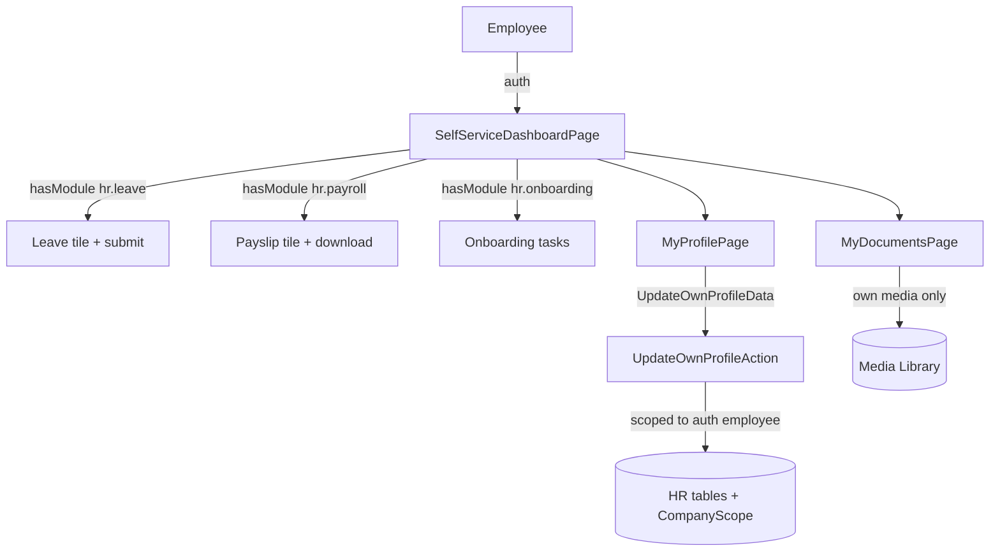

# Architecture — Employee Self-Service

> Intended design. No code exists yet (see [[../../../decisions/decision-2026-06-19-strip-to-app-admin-shell]]).

## Services & Actions

- `UpdateOwnProfileAction::run(UpdateOwnProfileData $data): void` — will operate strictly on `auth()->user()->employee`.
- **Own-data rule** (core invariant): every query in this module is intended to add `whereBelongsTo(auth()->user()->employee)` / `where('employee_id', $self->id)` **on top of** `CompanyScope` — a second isolation layer.

## Filament Artifacts

**Nav group:** top-level **"My HR"**, visible to all authenticated employees.

| Artifact | Kind ([[../../../architecture/ui-strategy]] row) | Blueprint / Tweaks | Notes |
|---|---|---|---|
| `SelfServiceDashboardPage` | #6 Dashboard custom page | [[../../../architecture/patterns/page-blueprints#Dashboard]] | tiles: leave balance, next payslip, pending tasks — soft-dep tiles conditional on `hasModule` ([[features/my-leave]], [[features/my-payslips]], [[features/my-onboarding]]) |
| `MyProfilePage` | #7 custom page (single-step form) | [[../../../architecture/patterns/page-blueprints#Wizard]] — single-step profile form *(assumed — closest blueprint; no multi-step)* | own-profile edit + photo + emergency contacts; sensitive fields read-only ([[features/my-profile]]) |
| `MyDocumentsPage` | #17 Gallery / directory grid custom page *(assumed — own-doc list)* | [[../../../architecture/patterns/page-blueprints#Gallery / Directory Grid]] | personal docs from Media Library, read-only own scope ([[features/my-documents]]) |

> **UNVERIFIED — panel placement:** `_module` prose places these in the `/hr` panel ("My HR" nav group) as Filament custom pages, but the feature notes route them at `/app/...` and sibling specs (dei-metrics, onboarding) describe self-service as an `/app` employee workspace. If self-service is `/app` Vue+Inertia instead, these become scoped-portal Inertia pages (ui-strategy rows #14/#15), not Filament artifacts. Resolve before build. *(assumed: Filament custom pages, per this module's architecture.)*

## Intended Flow

**Access contract (mandatory):** every artifact is a custom page and MUST state it explicitly — Filament does not auto-gate custom pages:
`canAccess() = Auth::user()->can('hr.self-service.view') && BillingService::hasModule('hr.self-service')`
per [[../../../architecture/filament-patterns]] #1. On top of `CompanyScope`, **every query adds a self-scope** (`where('employee_id', $self->id)` / `whereBelongsTo(auth()->user()->employee)`) — the defining security property ([[security]]). Own-profile edit requires `hr.self-service.update-own`; soft-dep surfaces (leave/payslip/onboarding) are additionally hidden unless their owning module is active, and any write delegates to that module's owning service.

## Concurrency

| Write path | Tier | Mechanism |
|---|---|---|
| Own-profile edit (`UpdateOwnProfileAction` → hr.profiles) | Optimistic | inherits hr.profiles' `updated_at` stale-check on the employee row ([[../../../architecture/patterns/optimistic-locking]]) |
| Leave submit / onboarding task complete (delegated) | Pessimistic (delegated) | handled by the owning module's write path (hr.leave state transition + balance lock; hr.onboarding task update) — this module issues no direct write |
| Dashboard / payslip / document reads | n/a | read-only, self-scoped |

This module owns no tables; every mutation delegates to the owning module. Tiers per [[../../../decisions/decision-2026-07-02-optimistic-locking-standard]].

## Implementation Notes (intended)

- **My HR dashboard** is intended to use a greeting header plus icon stat cards inside Sections, keeping the same data contract and deferred loading. (Previously noted as a build sync on 2026-06-12; now future-tense — not yet implemented after the strip.)
