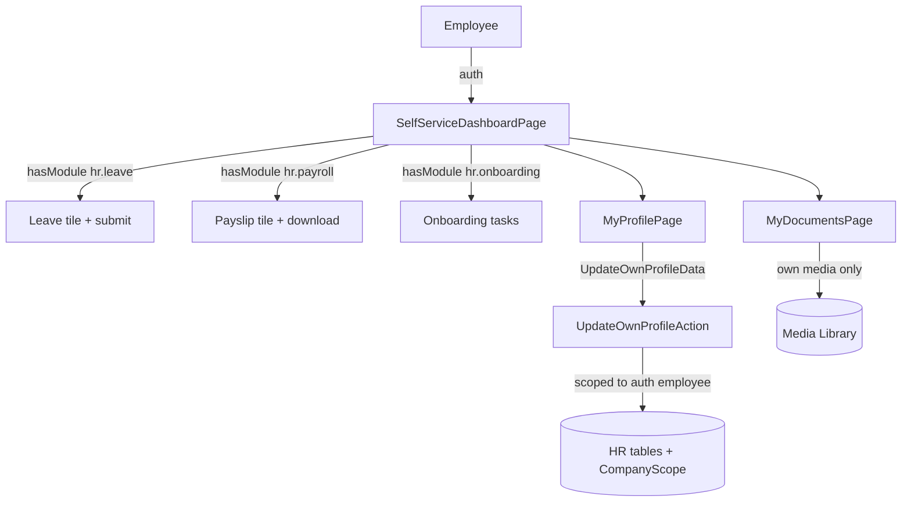

# Architecture — Employee Self-Service

> Intended design. No code exists yet (see [[../../../decisions/decision-2026-06-19-strip-to-app-admin-shell]]).

## Services & Actions

- `UpdateOwnProfileAction::run(UpdateOwnProfileData $data): void` — will operate strictly on `auth()->user()->employee`.
- **Own-data rule** (core invariant): every query in this module is intended to add `whereBelongsTo(auth()->user()->employee)` / `where('employee_id', $self->id)` **on top of** `CompanyScope` — a second isolation layer.

## Custom Pages ([[../../../architecture/patterns/custom-pages]])

Nav group: top-level **"My HR"**, visible to all authenticated `/hr` users.

| Artifact | Kind (ui-strategy row) | Notes |
|---|---|---|
| `SelfServiceDashboardPage` | #6 dashboard custom page | tiles: leave balance, next payslip, pending tasks — soft-dep tiles conditional on `hasModule` |
| `MyProfilePage` | #7 custom page (form) | own-profile edit + photo + emergency contacts |
| `MyDocumentsPage` | #1-style list (own scope) | personal docs from Media Library |

## Intended Flow

## Implementation Notes (intended)

- **My HR dashboard** is intended to use a greeting header plus icon stat cards inside Sections, keeping the same data contract and deferred loading. (Previously noted as a build sync on 2026-06-12; now future-tense — not yet implemented after the strip.)
