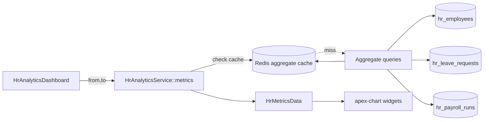

# HR Analytics — Architecture

Read-only analytics layer over other HR modules. No tables of its own; all data sourced from `hr_employees`, `hr_leave_requests`, `hr_payroll_runs`. Pattern: [[../../../architecture/patterns/custom-pages]].

## Services & Actions

- `HrAnalyticsService::metrics(CarbonImmutable $from, CarbonImmutable $to): HrMetricsData` — single service, all aggregate queries, intended to be N+1-free.

Output DTO `HrMetricsData` carries: `period`, `headcount_series[]`, `turnover_rate`, `dept_breakdown[]`, `leave_utilisation[]`, `hires_per_month[]`, `tenure_histogram[]`.

## Filament Artifacts

**Nav group:** Analytics

| Artifact | Kind ([[../../../architecture/ui-strategy]] row) | Blueprint / Tweaks | Notes |
|---|---|---|---|
| `HrAnalyticsDashboard` | #6 Dashboard custom page | [[../../../architecture/patterns/page-blueprints#Dashboard]] | period filter in header; widget polling 60s; PNG/CSV export action (rate-limited); soft-dep widgets conditional on `hasModule` |
| `HeadcountTrendWidget` · `TurnoverWidget` · `DeptBreakdownWidget` · `TenureWidget` | #6 dashboard widgets | [[../../../architecture/patterns/page-blueprints#Dashboard]] | `leandrocfe/filament-apex-charts`; each `canView()`-gated ([[features/headcount-analytics]], [[features/turnover-attrition]]) |
| `LeaveUtilisationWidget` | #6 dashboard widget | [[../../../architecture/patterns/page-blueprints#Dashboard]] | rendered only when `hr.leave` active ([[features/leave-analytics]]) |
| cost widget | #6 dashboard widget | [[../../../architecture/patterns/page-blueprints#Dashboard]] | band-level only; rendered only when `hr.payroll` active; never individual salaries ([[features/cost-analytics]]) |

**Access contract (mandatory):** `HrAnalyticsDashboard` is a custom page and MUST state it explicitly — Filament does not auto-gate custom pages:
`canAccess() = Auth::user()->can('hr.analytics.view') && BillingService::hasModule('hr.analytics')`
per [[../../../architecture/filament-patterns]] #1. Each widget is additionally `canView()`-gated; leave/cost widgets also check their soft-dep module. The export action requires `hr.analytics.export` and cites the `exports` rate limiter. Aggregate-only: no individual salary or DEI value ever reaches a payload ([[security]]). No public/portal surface.

## Flow

## Caching

Redis caching of computed aggregates — dashboard staleness is acceptable, so TTL-only invalidation. See [[../../../infrastructure/cache-redis]] and [[../../../architecture/caching]].

| Key | TTL | Invalidated by |
|---|---|---|
| `company:{id}:hr:analytics:{from}:{to}` | 1 h (historical) / 15 min (current period) | TTL only |

## Concurrency

| Write path | Tier | Mechanism |
|---|---|---|
| All dashboards, widgets, metric queries | n/a | read-only aggregation — this module owns no tables and performs no writes; the Redis aggregate cache is TTL-invalidated, not written transactionally |
| CSV/PNG export | n/a | read-only render of already-computed aggregates; no record mutation (rate-limited per [[security]]) |

Tiers per [[../../../decisions/decision-2026-07-02-optimistic-locking-standard]].
