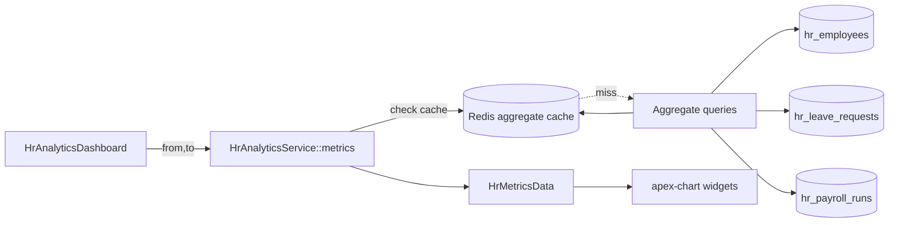

# HR Analytics — Architecture

Read-only analytics layer over other HR modules. No tables of its own; all data sourced from `hr_employees`, `hr_leave_requests`, `hr_payroll_runs`. Pattern: [[../../../architecture/patterns/custom-pages]].

## Services & Actions

- `HrAnalyticsService::metrics(CarbonImmutable $from, CarbonImmutable $to): HrMetricsData` — single service, all aggregate queries, intended to be N+1-free.

Output DTO `HrMetricsData` carries: `period`, `headcount_series[]`, `turnover_rate`, `dept_breakdown[]`, `leave_utilisation[]`, `hires_per_month[]`, `tenure_histogram[]`.

## Filament Surface

| Artifact | Kind (ui-strategy #6) | Notes |
|---|---|---|
| `HrAnalyticsDashboard` | dashboard page + apex-chart widgets | period filter in header; widget polling 60s; soft-dep widgets conditional |

Widgets: `HeadcountTrendWidget`, `TurnoverWidget`, `DeptBreakdownWidget`, `LeaveUtilisationWidget`, `TenureWidget` — built on `leandrocfe/filament-apex-charts`. Leave/cost widgets render only when their soft-dep module is active.

## Flow

## Caching

Redis caching of computed aggregates — dashboard staleness is acceptable, so TTL-only invalidation. See [[../../../infrastructure/cache-redis]] and [[../../../architecture/caching]].

| Key | TTL | Invalidated by |
|---|---|---|
| `company:{id}:hr:analytics:{from}:{to}` | 1 h (historical) / 15 min (current period) | TTL only |
