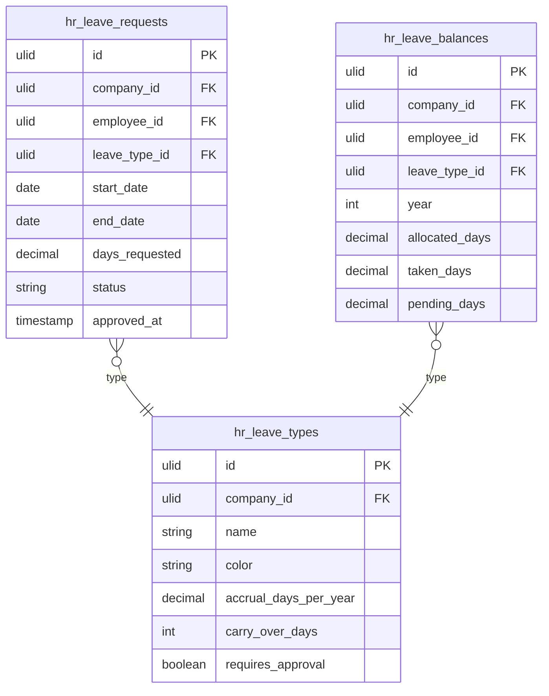

# Leave Management

Leave requests, multi-level approval workflows, leave balances, accrual rules, and a team calendar view. Employees submit requests via Self-Service; managers approve in `/hr`.

---

## Core Features

- Leave types: annual, sick, parental, unpaid, custom — configurable per company
- Leave request lifecycle: `draft → submitted → approved | rejected | cancelled` (spatie/laravel-model-states)
- Multi-level approval: configurable chain (employee → manager → HR)
- Leave balances: accrual by day/month/year, carry-over rules, balance cap
- Team calendar: monthly/weekly view of approved leaves across team (via `saade/filament-fullcalendar`)
- Overlap detection: warns when request overlaps with existing approved leave or public holiday
- Public holiday calendar imported from locale settings
- Leave balance report: days taken, remaining, pending per employee per type
- Notifications: approval/rejection via email and in-app (Core Notifications)

---

## Data Model

| Table | Key Columns |
|---|---|
| `hr_leave_types` | company_id, name, color, accrual_days_per_year, carry_over_days, requires_approval |
| `hr_leave_balances` | company_id, employee_id, leave_type_id, year, allocated_days, taken_days, pending_days |
| `hr_leave_requests` | company_id, employee_id, leave_type_id, start_date, end_date, days_requested, status, note, approved_by, approved_at |

---

## Filament

**Nav group:** Leave

- `LeaveRequestResource` — list (pending tab / all tab), create, view, approve/reject actions
- `LeaveBalanceResource` — read-only balance overview per employee per type
- `LeaveCalendarPage` (custom page) — full calendar view with leave overlays, filterable by team
- `LeaveTypeResource` — admin configuration of leave types, accrual rules

---

## Related

- [[domains/hr/employee-profiles]]
- [[domains/hr/employee-self-service]]
- [[architecture/packages]] (`spatie/laravel-model-states`, `saade/filament-fullcalendar`)
