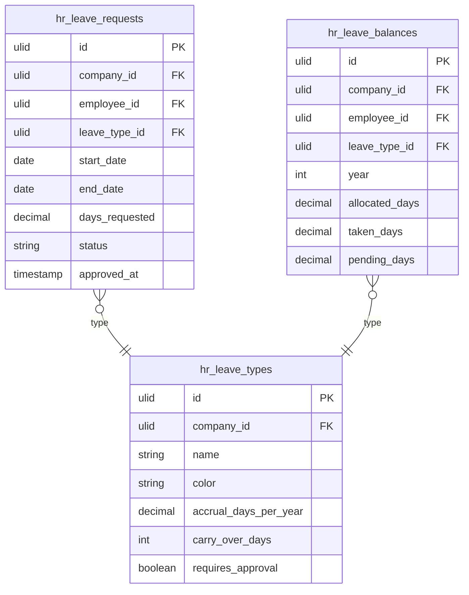

# Leave Management

Leave requests, multi-level approval workflows, leave balances, accrual rules, and a team calendar view. Employees submit requests via Self-Service; managers approve in `/hr`. One of the two most-used HR modules (with profiles) — the land-and-expand entry point for many customers.

---

## Dependencies

| Type | Module | Why |
|---|---|---|
| Hard | [[domains/hr/employee-profiles\|hr.profiles]] | Requests belong to employees; manager chain comes from `manager_id` |
| Hard | [[domains/core/billing-engine\|core.billing]] | Module gating via `hasModule('hr.leave')` |
| Hard | [[domains/core/rbac\|core.rbac]] | Approval permissions |
| Hard | [[domains/core/notifications\|core.notifications]] | Approval/rejection notifications (in-app + email) |
| Soft | [[domains/hr/payroll\|hr.payroll]] | Consumes `LeaveRequestApproved` for deductions; without it the event fires with no listener |
| Soft | [[domains/hr/shift-scheduling\|hr.shifts]] | Consumes `LeaveRequestApproved` to block shifts; degrades to no shift blocking |
| Soft | [[domains/hr/employee-self-service\|hr.self-service]] | Submission UI for employees; without it HR staff submit on behalf *(assumed)* |

---

## Core Features

- Leave types: annual, sick, parental, unpaid, custom — configurable per company
- Leave request lifecycle: `draft → submitted → approved | rejected | cancelled` (spatie/laravel-model-states)
- Multi-level approval: configurable chain (employee → manager → HR)
- Leave balances: accrual by day/month/year, carry-over rules, balance cap
- Team calendar: monthly/weekly view of approved leaves across team (via `saade/filament-fullcalendar`)
- Overlap detection: warns when request overlaps with existing approved leave or public holiday
- Public holiday calendar imported from locale settings
- Leave balance report: days taken, remaining, pending per employee per type
- Notifications: approval/rejection via email and in-app (Core Notifications)

---

## Data Model

### hr_leave_types

| Column | Type | Constraints | Notes |
|---|---|---|---|
| id | ulid | PK | |
| company_id | ulid | not null, FK companies, indexed | BelongsToCompany |
| name | string | not null | unique per company *(assumed)* |
| color | string(7) | not null, default `#4ADE80` *(assumed)* | hex, calendar display |
| accrual_days_per_year | decimal(5,2) | not null, default 0 | 0 = no accrual (e.g. unpaid) |
| carry_over_days | int | not null, default 0 | days carried into next year |
| requires_approval | boolean | not null, default true | false = auto-approve on submit |
| deleted_at | timestamp | nullable | SoftDeletes |

**Indexes:** `(company_id, name)` unique *(assumed)*

### hr_leave_balances

| Column | Type | Constraints | Notes |
|---|---|---|---|
| id | ulid | PK | |
| company_id | ulid | not null, FK companies, indexed | |
| employee_id | ulid | not null, FK hr_employees | |
| leave_type_id | ulid | not null, FK hr_leave_types | |
| year | int | not null | calendar year |
| allocated_days | decimal(5,2) | not null, default 0 | accrual + carry-over + manual adjustment |
| taken_days | decimal(5,2) | not null, default 0 | |
| pending_days | decimal(5,2) | not null, default 0 | submitted-not-yet-approved |
| deleted_at | timestamp | nullable | |

**Indexes:** `(company_id, employee_id, leave_type_id, year)` unique

### hr_leave_requests

| Column | Type | Constraints | Notes |
|---|---|---|---|
| id | ulid | PK | |
| company_id | ulid | not null, FK companies, indexed | |
| employee_id | ulid | not null, FK hr_employees | |
| leave_type_id | ulid | not null, FK hr_leave_types | |
| start_date | date | not null | |
| end_date | date | not null | ≥ start_date |
| days_requested | decimal(5,2) | not null | computed: working days excl. public holidays |
| status | string | not null, default `draft` | state machine column |
| note | text | nullable | employee note |
| approved_by | ulid | nullable, FK users | |
| approved_at | timestamp | nullable | |
| rejection_reason | text | nullable | *(assumed)* |
| deleted_at | timestamp | nullable | |

**Indexes:** `(company_id, employee_id, status)`, `(company_id, start_date, end_date)` for overlap/calendar queries



---

## State Machine

Column: `hr_leave_requests.status` — spatie/laravel-model-states, base `LeaveRequestState`.

| State | Transitions to | Triggered by (permission) | Side effects |
|---|---|---|---|
| `draft` | `submitted` | employee (own) / `hr.leave.create` | balance `pending_days` += days |
| `submitted` | `approved` | `hr.leave.approve` (manager in chain) | fires `LeaveRequestApproved`; balance pending→taken; notification |
| `submitted` | `rejected` | `hr.leave.reject` | balance pending released; notification with reason |
| `submitted` | `cancelled` | employee (own, before approval) | balance pending released |
| `approved` | `cancelled` | `hr.leave.approve` + employee request, only before start_date *(assumed)* | balance taken released; notify approver chain |

Initial: `draft`. Terminal: `rejected`, `cancelled` (and `approved` after start_date). Transitions audited via activitylog.

---

## DTOs

### SubmitLeaveRequestData (input)

| Field | Type | Validation |
|---|---|---|
| employee_id | string | required, ulid, exists in company |
| leave_type_id | string | required, ulid, exists in company |
| start_date | CarbonImmutable | required, date |
| end_date | CarbonImmutable | required, date |
| note | ?string | nullable, max:1000 *(assumed)* |

Cross-field: `end_date >= start_date` ("End date must be on or after start date"); requested span must yield ≥ 0.5 working days *(assumed)*; warn (not block) on overlap with approved leave / public holiday.

### ApproveLeaveRequestData (input)
| Field | Type | Validation |
|---|---|---|
| leave_request_id | string | required, ulid |

### RejectLeaveRequestData (input)
| Field | Type | Validation |
|---|---|---|
| leave_request_id | string | required, ulid |
| rejection_reason | string | required, max:1000 |

### LeaveRequestData (output)
id, employee_id, employee_name, leave_type_id, leave_type_name, start_date, end_date, days_requested, status, note, approved_by, approved_at, rejection_reason

### LeaveBalanceData (output)
employee_id, leave_type_id, year, allocated_days, taken_days, pending_days, remaining_days (computed)

---

## Services & Actions

Interface→Service (multi-method, complex): `LeaveServiceInterface` → `LeaveService`, bound in `Providers/HR`.

- `submit(SubmitLeaveRequestData $data): LeaveRequestData` — throws `InsufficientLeaveBalanceException`, `OverlappingLeaveException` (only when type forbids overlap *(assumed)*)
- `approve(ApproveLeaveRequestData $data): LeaveRequestData` — throws `InvalidStateTransitionException`, `CannotApproveOwnRequestException`
- `reject(RejectLeaveRequestData $data): LeaveRequestData` — throws `InvalidStateTransitionException`
- `cancel(string $leaveRequestId): LeaveRequestData` — throws `InvalidStateTransitionException`
- `balanceFor(string $employeeId, int $year): Collection<LeaveBalanceData>`
- `calculateWorkingDays(CarbonImmutable $start, CarbonImmutable $end): float` — excludes weekends + public holidays
- `accrueMonthly(): void` — scheduled, see Jobs

---

## Events

### Fires: LeaveRequestApproved

| Payload field | Type | Notes |
|---|---|---|
| company_id | string | always first |
| leave_request_id | string | |
| employee_id | string | |
| leave_type_id | string | |
| start_date | CarbonImmutable | |
| end_date | CarbonImmutable | |
| days | float | working days |

Consumed by: `hr.payroll` (`UpdatePayrollDeductionsListener` — unpaid-type deductions), `hr.shifts` (block scheduling over the range). Contract source of truth: [[architecture/event-bus]].

---

## Filament

**Nav group:** Leave

| Artifact | Kind ([[architecture/ui-strategy]] row) | Notes |
|---|---|---|
| `LeaveRequestResource` | #1 CRUD resource | tabs: Pending / All; approve & reject table actions (permission-gated) |
| `LeaveBalanceResource` | #1 CRUD resource (read-only) | per employee per type; no create/edit |
| `LeaveTypeResource` | #1 CRUD resource | admin config: accrual, carry-over, approval flag |
| `LeaveCalendarPage` | #4 Calendar custom page | `saade/filament-fullcalendar`, team filter, polling 30s |
| `PendingApprovalsWidget` | #6 dashboard widget | count for current approver *(assumed)* |


**Access contract:** every artifact above gates on `canAccess() = Auth::user()->can('hr.leave.view-any') && BillingService::hasModule('hr.leave')` per [[architecture/filament-patterns]] #1 — custom pages state it explicitly. Public/portal surfaces use a guest or scoped-portal guard (Vue+Inertia per [[architecture/ui-strategy]]).

---

## Permissions

`hr.leave.view-any` · `hr.leave.view` · `hr.leave.create` · `hr.leave.update` · `hr.leave.delete` · `hr.leave.approve` · `hr.leave.reject` · `hr.leave.manage-types`

Seeded in `PermissionSeeder`. Employees get `create` + `view` (own) via self-service role; managers get `approve`/`reject`.

---

## Jobs & Scheduling

| Job / Command | Queue | Schedule | Idempotency |
|---|---|---|---|
| `AccrueLeaveBalancesCommand` | `default` | monthly, 1st 02:00 | upsert on `(company, employee, type, year)` — safe to re-run |
| `CarryOverLeaveBalancesCommand` | `default` | yearly, Jan 1 03:00 | skips rows already carried (`allocated_days` includes carry marker) *(assumed)* |
| `LeaveApprovedMail` / `LeaveRejectedMail` | `notifications` | on transition | — |

---

## Search & Realtime

No Meilisearch index. Calendar + pending lists: Livewire polling 30s (ui-strategy realtime rule — no Reverb; not collaborative).

---

## Test Checklist

- [ ] Tenant isolation: company A approver cannot see/approve company B requests
- [ ] Module gating: all resources + calendar hidden when `hr.leave` inactive
- [ ] Submit decrements available balance into pending; reject/cancel releases it
- [ ] Approve transitions state, sets approver, fires `LeaveRequestApproved` with contract payload
- [ ] Approver cannot approve own request
- [ ] Overlap warning on overlapping approved leave; public holidays excluded from `days_requested`
- [ ] `requires_approval = false` type auto-approves on submit
- [ ] Accrual command idempotent (run twice = same balances)
- [ ] Invalid transitions throw (`approved → submitted`, etc.)

---

## Build Manifest

```
database/migrations/xxxx_create_hr_leave_types_table.php
database/migrations/xxxx_create_hr_leave_balances_table.php
database/migrations/xxxx_create_hr_leave_requests_table.php
app/Models/HR/{LeaveType,LeaveBalance,LeaveRequest}.php
app/States/HR/LeaveRequest/{LeaveRequestState,Draft,Submitted,Approved,Rejected,Cancelled}.php
app/Data/HR/{SubmitLeaveRequestData,ApproveLeaveRequestData,RejectLeaveRequestData,LeaveRequestData,LeaveBalanceData}.php
app/Contracts/HR/LeaveServiceInterface.php
app/Services/HR/LeaveService.php
app/Exceptions/HR/{InsufficientLeaveBalanceException,OverlappingLeaveException,CannotApproveOwnRequestException}.php
app/Events/HR/LeaveRequestApproved.php
app/Mail/HR/{LeaveApprovedMail,LeaveRejectedMail}.php
app/Console/Commands/HR/{AccrueLeaveBalancesCommand,CarryOverLeaveBalancesCommand}.php
app/Filament/HR/Resources/{LeaveRequestResource,LeaveBalanceResource,LeaveTypeResource}.php
app/Filament/HR/Pages/LeaveCalendarPage.php
app/Filament/HR/Widgets/PendingApprovalsWidget.php
database/factories/HR/{LeaveTypeFactory,LeaveBalanceFactory,LeaveRequestFactory}.php
tests/Feature/HR/{LeaveRequestTest,LeaveBalanceTest,LeaveCalendarTest}.php
```

---

## Open Questions

- Multi-level chain depth: v1 implements single-level (direct manager) with config hook for chains *(assumed)* — extend when a customer needs >1 level
- Half-day requests: supported via decimal `days_requested`; UI exposes full/half-day toggle *(assumed)*

---

## Related

- [[domains/hr/employee-profiles]]
- [[domains/hr/employee-self-service]]
- [[domains/hr/payroll]]
- [[domains/hr/shift-scheduling]]
- [[domains/core/notifications]]
- [[architecture/event-bus]]
- [[architecture/packages]] (`spatie/laravel-model-states`, `saade/filament-fullcalendar`)
