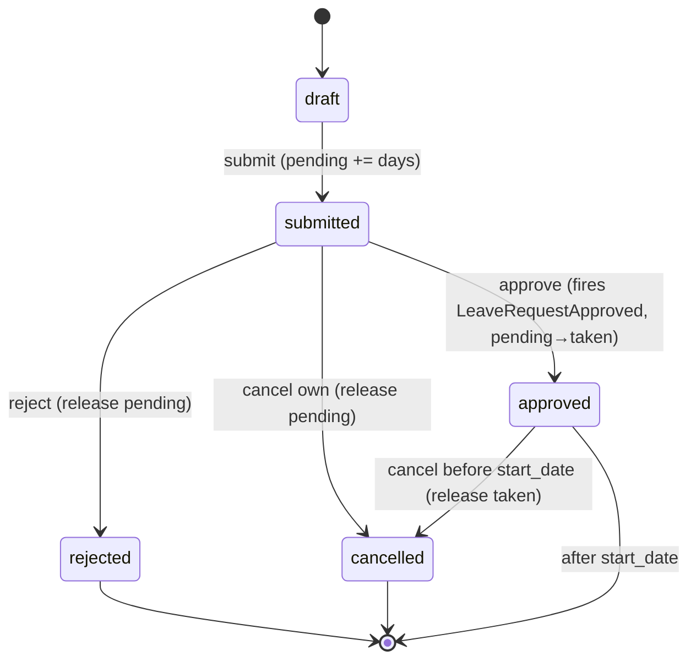

# Leave Management — Architecture

Intended services, actions, and state machine. See [[data-model]] for tables and [[api]] for DTOs/events. Pattern refs: [[../../../architecture/patterns/interface-service]], [[../../../architecture/patterns/states]], [[../../../architecture/patterns/custom-pages]].

## Services & Actions

Interface→Service (multi-method, complex): `LeaveServiceInterface` → `LeaveService`, bound in `Providers/HR`.

- `submit(SubmitLeaveRequestData $data): LeaveRequestData` — throws `InsufficientLeaveBalanceException`, `OverlappingLeaveException` (only when type forbids overlap *(assumed)*)
- `approve(ApproveLeaveRequestData $data): LeaveRequestData` — throws `InvalidStateTransitionException`, `CannotApproveOwnRequestException`
- `reject(RejectLeaveRequestData $data): LeaveRequestData` — throws `InvalidStateTransitionException`
- `cancel(string $leaveRequestId): LeaveRequestData` — throws `InvalidStateTransitionException`
- `balanceFor(string $employeeId, int $year): Collection<LeaveBalanceData>`
- `calculateWorkingDays(CarbonImmutable $start, CarbonImmutable $end): float` — excludes weekends + public holidays
- `accrueMonthly(): void` — scheduled, see [[features/accrual-jobs]]

## State Machine

Column: `hr_leave_requests.status` — spatie/laravel-model-states, base `LeaveRequestState`. Transitions audited via activitylog.

| State | Transitions to | Triggered by (permission) | Side effects |
|---|---|---|---|
| `draft` | `submitted` | employee (own) / `hr.leave.create` | balance `pending_days` += days |
| `submitted` | `approved` | `hr.leave.approve` (manager in chain) | fires `LeaveRequestApproved`; balance pending→taken; notification |
| `submitted` | `rejected` | `hr.leave.reject` | balance pending released; notification with reason |
| `submitted` | `cancelled` | employee (own, before approval) | balance pending released |
| `approved` | `cancelled` | `hr.leave.approve` + employee request, only before start_date *(assumed)* | balance taken released; notify approver chain |

Initial: `draft`. Terminal: `rejected`, `cancelled` (and `approved` after start_date).

> **As built 2026-07-05:** `LeaveCalendarPage` is the Teams-style custom calendar (fullcalendar has no Filament 5 build): month = full-week grid w/ dimmed adjacent-month days + event bars; week = all-day banner row over a scrollable 24h hour grid with a live now-line. Canonical calendar composition: [[../../../architecture/patterns/page-blueprints#Calendar]].

## Filament Artifacts

**Nav group:** Leave

| Artifact | Kind ([[../../../architecture/ui-strategy]] row) | Blueprint / Tweaks | Notes |
|---|---|---|---|
| `LeaveRequestResource` | #1 CRUD resource | tweaks: state-badge-column (request status + transition group), custom-header-actions (approve / reject — each own permission, reject opens reason modal) | Pending / All tabs; approve & reject table actions ([[features/leave-request-workflow]]) |
| `LeaveBalanceResource` | #1 CRUD resource | tweaks: read-only-flow-owned (`canCreate(): false` — balances written by `LeaveService` + accrual commands) | read-only ledger; filter by employee / type / year ([[features/leave-balances]]) |
| `LeaveTypeResource` | #1 CRUD resource | tweaks: *(none — plain admin config)* | `hr.leave.manage-types` ([[features/leave-types]]) |
| `LeaveCalendarPage` | #4 Calendar custom page | [[../../../architecture/patterns/page-blueprints#Calendar]] | `saade/filament-fullcalendar`; approved leave + public holidays; polling 30s, no Reverb ([[features/team-calendar]]) |
| `PendingApprovalsWidget` | #6 dashboard widget | [[../../../architecture/patterns/page-blueprints#Dashboard]] | current approver's pending count; polling 30–60s |

**Access contract (mandatory):** every artifact gates on
`canAccess() = Auth::user()->can('hr.leave.view-any') && BillingService::hasModule('hr.leave')`
per [[../../../architecture/filament-patterns]] #1. `LeaveCalendarPage` is a custom page and MUST state it explicitly — Filament does not auto-gate custom pages. Approve/reject actions additionally require `hr.leave.approve` / `hr.leave.reject`, and the service enforces `CannotApproveOwnRequestException` regardless of permission. The employee submission surface is `hr.self-service` (Vue+Inertia per [[../../../architecture/ui-strategy]], scoped-portal guard); without it HR submits on behalf.

## Concurrency

| Write path | Tier | Mechanism |
|---|---|---|
| Leave-type & request CRUD (form, API) | Optimistic | `updated_at` stale-check on save → `StaleRecordException` → conflict notification ([[../../../architecture/patterns/optimistic-locking]]) |
| Request state transition (submit / approve / reject / cancel) + balance pending↔taken mutation | Pessimistic | `DB::transaction()` + `lockForUpdate()` on the balance row, re-read, validate, write per [[../../../architecture/patterns/states]] — prevents two approvals double-decrementing a balance |
| Accrual / carry-over balance writes (scheduled commands) | n/a | idempotent upsert on `(company, employee, type, year)` — single scheduler writer, safe to re-run |
| Team calendar | n/a | read-only view over `hr_leave_requests` |

Tiers per [[../../../decisions/decision-2026-07-02-optimistic-locking-standard]].

## Related

- [[_module]]
- [[api]]
- [[../../../architecture/event-bus]]
