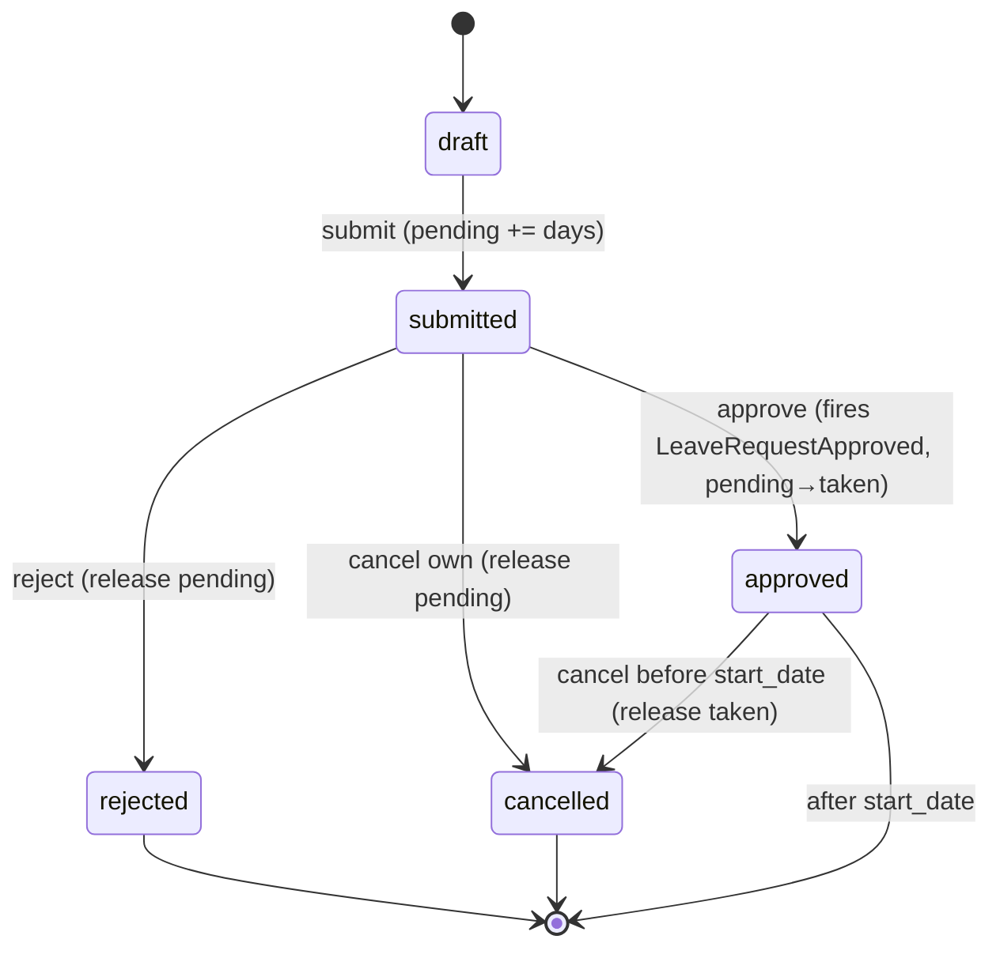

# Leave Management — Architecture

Intended services, actions, and state machine. See [[data-model]] for tables and [[api]] for DTOs/events. Pattern refs: [[../../../architecture/patterns/interface-service]], [[../../../architecture/patterns/states]], [[../../../architecture/patterns/custom-pages]].

## Services & Actions

Interface→Service (multi-method, complex): `LeaveServiceInterface` → `LeaveService`, bound in `Providers/HR`.

- `submit(SubmitLeaveRequestData $data): LeaveRequestData` — throws `InsufficientLeaveBalanceException`, `OverlappingLeaveException` (only when type forbids overlap *(assumed)*)
- `approve(ApproveLeaveRequestData $data): LeaveRequestData` — throws `InvalidStateTransitionException`, `CannotApproveOwnRequestException`
- `reject(RejectLeaveRequestData $data): LeaveRequestData` — throws `InvalidStateTransitionException`
- `cancel(string $leaveRequestId): LeaveRequestData` — throws `InvalidStateTransitionException`
- `balanceFor(string $employeeId, int $year): Collection<LeaveBalanceData>`
- `calculateWorkingDays(CarbonImmutable $start, CarbonImmutable $end): float` — excludes weekends + public holidays
- `accrueMonthly(): void` — scheduled, see [[features/accrual-jobs]]

## State Machine

Column: `hr_leave_requests.status` — spatie/laravel-model-states, base `LeaveRequestState`. Transitions audited via activitylog.

| State | Transitions to | Triggered by (permission) | Side effects |
|---|---|---|---|
| `draft` | `submitted` | employee (own) / `hr.leave.create` | balance `pending_days` += days |
| `submitted` | `approved` | `hr.leave.approve` (manager in chain) | fires `LeaveRequestApproved`; balance pending→taken; notification |
| `submitted` | `rejected` | `hr.leave.reject` | balance pending released; notification with reason |
| `submitted` | `cancelled` | employee (own, before approval) | balance pending released |
| `approved` | `cancelled` | `hr.leave.approve` + employee request, only before start_date *(assumed)* | balance taken released; notify approver chain |

Initial: `draft`. Terminal: `rejected`, `cancelled` (and `approved` after start_date).

## Related

- [[_module]]
- [[api]]
- [[../../../architecture/event-bus]]
