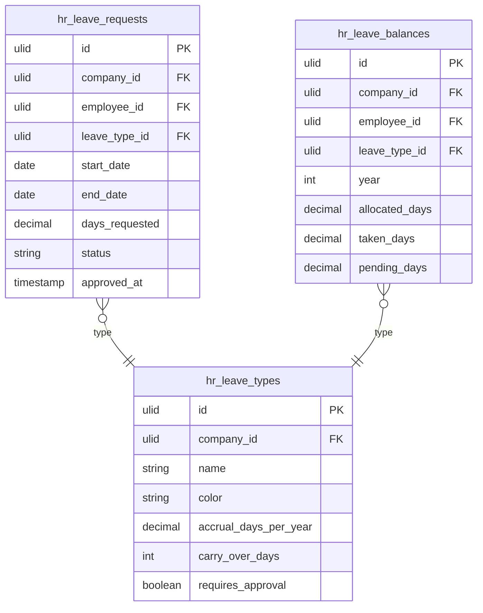

# Leave Management — Data Model

Tables owned: `hr_leave_types`, `hr_leave_balances`, `hr_leave_requests`. All carry `BelongsToCompany` + `SoftDeletes`. Storage refs: [[../../../infrastructure/database]], tenancy in [[security]].

## hr_leave_types

| Column | Type | Constraints | Notes |
|---|---|---|---|
| id | ulid | PK | |
| company_id | ulid | not null, FK companies, indexed | BelongsToCompany |
| name | string | not null | unique per company *(assumed)* |
| color | string(7) | not null, default `#4ADE80` *(assumed)* | hex, calendar display |
| accrual_days_per_year | decimal(5,2) | not null, default 0 | 0 = no accrual (e.g. unpaid) |
| carry_over_days | int | not null, default 0 | days carried into next year |
| requires_approval | boolean | not null, default true | false = auto-approve on submit |
| deleted_at | timestamp | nullable | SoftDeletes |

**Indexes:** `(company_id, name)` unique *(assumed)*

## hr_leave_balances

| Column | Type | Constraints | Notes |
|---|---|---|---|
| id | ulid | PK | |
| company_id | ulid | not null, FK companies, indexed | |
| employee_id | ulid | not null, FK hr_employees | |
| leave_type_id | ulid | not null, FK hr_leave_types | |
| year | int | not null | calendar year |
| allocated_days | decimal(5,2) | not null, default 0 | accrual + carry-over + manual adjustment |
| taken_days | decimal(5,2) | not null, default 0 | |
| pending_days | decimal(5,2) | not null, default 0 | submitted-not-yet-approved |
| deleted_at | timestamp | nullable | |

**Indexes:** `(company_id, employee_id, leave_type_id, year)` unique

## hr_leave_requests

| Column | Type | Constraints | Notes |
|---|---|---|---|
| id | ulid | PK | |
| company_id | ulid | not null, FK companies, indexed | |
| employee_id | ulid | not null, FK hr_employees | |
| leave_type_id | ulid | not null, FK hr_leave_types | |
| start_date | date | not null | |
| end_date | date | not null | ≥ start_date |
| days_requested | decimal(5,2) | not null | computed: working days excl. public holidays |
| status | string | not null, default `draft` | state machine column — see [[architecture]] |
| note | text | nullable | employee note |
| approved_by | ulid | nullable, FK users | |
| approved_at | timestamp | nullable | |
| rejection_reason | text | nullable | *(assumed)* |
| deleted_at | timestamp | nullable | |

**Indexes:** `(company_id, employee_id, status)`, `(company_id, start_date, end_date)` for overlap/calendar queries

## ERD

## Related

- [[_module]]
- [[architecture]]
