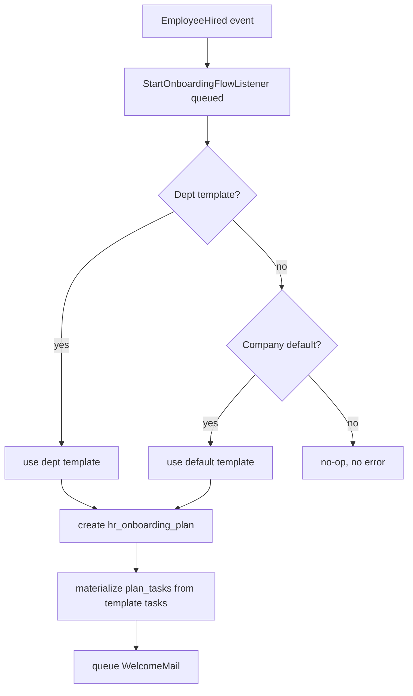
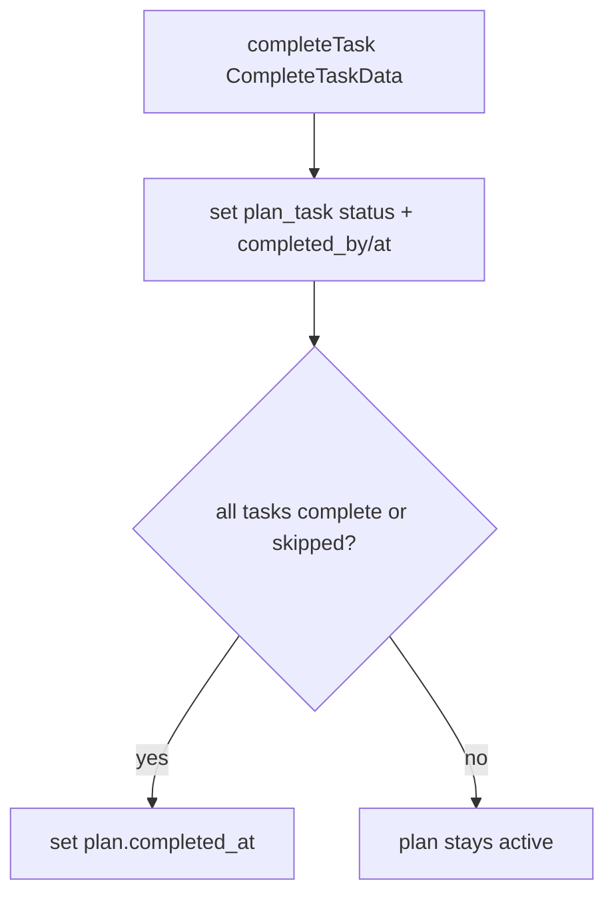

# Onboarding — Architecture

Interface→Service per [[../../../architecture/patterns/interface-service]]:
`OnboardingServiceInterface` → `OnboardingService`.

## Services & Actions

| Method | Signature | Behavior |
|---|---|---|
| `startPlan` | `startPlan(string $companyId, string $employeeId, ?string $templateId = null): OnboardingPlanData` | Picks dept template → company default → no-op when none. Materializes plan tasks from template tasks. Queues welcome mail. |
| `completeTask` | `completeTask(CompleteTaskData $data): void` | Marks a plan task complete/skipped; auto-sets plan `completed_at` when last task closed. |
| `progress` | `progress(string $planId): float` | Returns % of tasks complete/skipped. |

## Listener

`StartOnboardingFlowListener` — consumes `EmployeeHired`, queued, `WithCompanyContext`. Delegates to `OnboardingService::startPlan`. Behavior per [[../../../architecture/event-bus]] contract (default plan if template exists, else no-op, no error).

## Scheduled Work

`SendMilestoneCheckInsCommand` — daily 08:00, `notifications` queue. Sends 30/60/90d reminders relative to `started_at`, once per milestone. See [[../../../infrastructure/queue-horizon]] and [[../../../infrastructure/mail]].

## Flow: Plan Generation on Hire

## Flow: Task Completion

## Filament Artifacts

**Nav group:** Employees

| Artifact | Kind ([[../../../architecture/ui-strategy]] row) | Blueprint / Tweaks | Notes |
|---|---|---|---|
| `OnboardingResource` | #1 CRUD resource | tweaks: view-page-tabs (plan view — checklist grouped by `assigned_role`: HR/IT/manager/employee), custom-header-actions (complete-task / skip-task — each own permission) | list: active plans + % complete, days since start; document-collection + equipment tasks are `assigned_role` rows on the view tabs, not separate pages *(assumed)* |
| `OnboardingTemplateResource` | #1 CRUD resource | tweaks: inline-relation-repeater (ordered tasks with `assigned_role`) | manage-templates; validation blocks a second company default |
| `ActiveOnboardingsWidget` | #6 dashboard widget | [[../../../architecture/patterns/page-blueprints#Dashboard]] | stat cards: active onboardings, overdue check-ins *(assumed)*; polling 30–60s |

The progress-dashboard, document-collection, milestone-checkins and task-checklist surfaces are the `OnboardingResource` list + view tabs + the widget, not standalone custom pages — the Build Manifest defines no custom Page class *(assumed; the per-feature notes mark the standalone-page vs relation-manager split UNVERIFIED)*.

**Access contract (mandatory):** every artifact gates on
`canAccess() = Auth::user()->can('hr.onboarding.view-any') && BillingService::hasModule('hr.onboarding')`
per [[../../../architecture/filament-patterns]] #1. The employee-facing document/task completion surface is `hr.self-service` (Vue+Inertia per [[../../../architecture/ui-strategy]], scoped-portal guard), not a Filament artifact of this module; without it HR completes on behalf.

## Concurrency

| Write path | Tier | Mechanism |
|---|---|---|
| Template & task CRUD (resource form) | Optimistic | `updated_at` stale-check on save → `StaleRecordException` → conflict notification ([[../../../architecture/patterns/optimistic-locking]]) |
| Plan task complete / skip (Livewire action, API) | Optimistic | `updated_at` stale-check on the plan task; last-task-closes-plan side effect is idempotent (re-setting `completed_at` is a no-op) ([[../../../architecture/patterns/optimistic-locking]]) |
| Plan creation on `EmployeeHired` (listener) | n/a | Single-writer append — one plan inserted per hire; the listener is the only writer, guarded against duplicate plans per employee *(assumed)* |
| Milestone reminder send (scheduled command) | n/a | Append-only, once-per-milestone guard; no concurrent writers |

Tiers per [[../../../decisions/decision-2026-07-02-optimistic-locking-standard]].
