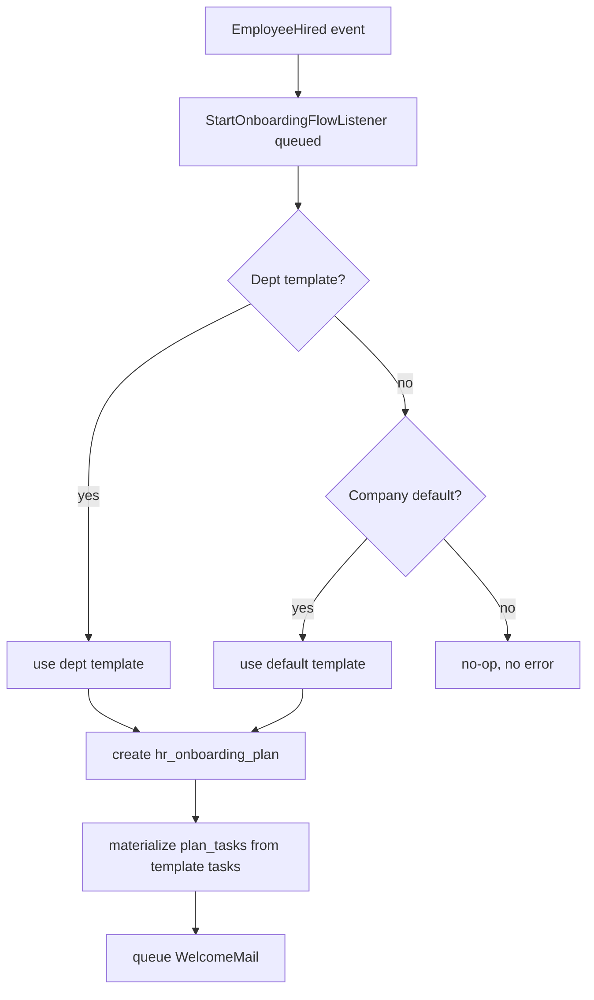
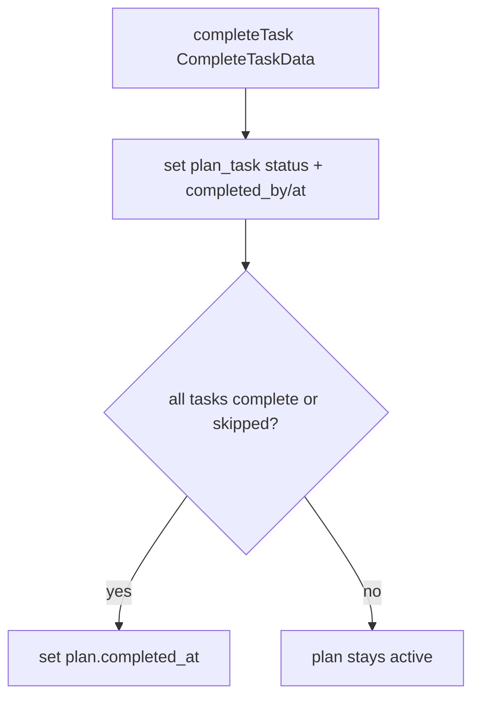

# Onboarding — Architecture

Interface→Service per [[../../../architecture/patterns/interface-service]]:
`OnboardingServiceInterface` → `OnboardingService`.

## Services & Actions

| Method | Signature | Behavior |
|---|---|---|
| `startPlan` | `startPlan(string $companyId, string $employeeId, ?string $templateId = null): OnboardingPlanData` | Picks dept template → company default → no-op when none. Materializes plan tasks from template tasks. Queues welcome mail. |
| `completeTask` | `completeTask(CompleteTaskData $data): void` | Marks a plan task complete/skipped; auto-sets plan `completed_at` when last task closed. |
| `progress` | `progress(string $planId): float` | Returns % of tasks complete/skipped. |

## Listener

`StartOnboardingFlowListener` — consumes `EmployeeHired`, queued, `WithCompanyContext`. Delegates to `OnboardingService::startPlan`. Behavior per [[../../../architecture/event-bus]] contract (default plan if template exists, else no-op, no error).

## Scheduled Work

`SendMilestoneCheckInsCommand` — daily 08:00, `notifications` queue. Sends 30/60/90d reminders relative to `started_at`, once per milestone. See [[../../../infrastructure/queue-horizon]] and [[../../../infrastructure/mail]].

## Flow: Plan Generation on Hire

## Flow: Task Completion

