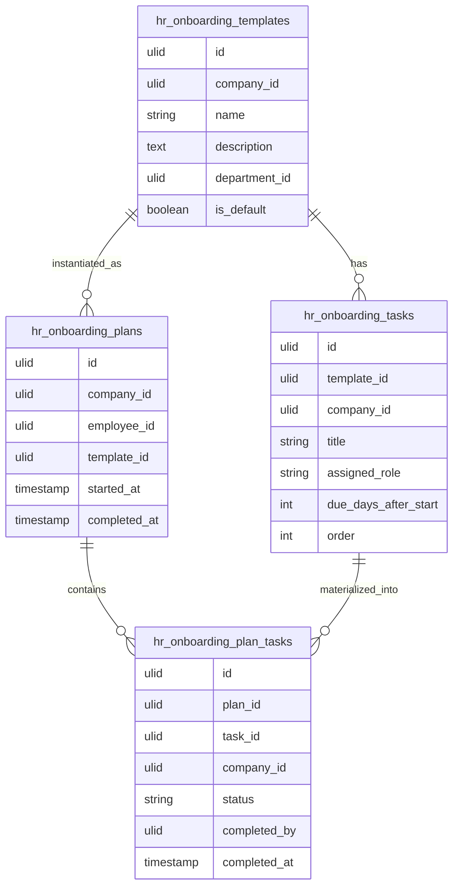

# Onboarding — Data Model

Tables: `hr_onboarding_templates`, `hr_onboarding_tasks`, `hr_onboarding_plans`, `hr_onboarding_plan_tasks`. All `BelongsToCompany`. See [[../../../infrastructure/database]] and [[../../../security/tenancy-isolation]].

## hr_onboarding_templates

| Column | Type | Constraints |
|---|---|---|
| id, company_id (indexed) | ulid | |
| name | string | not null |
| description | text | nullable |
| department_id | ulid | nullable FK — null = company default |
| is_default | boolean | default false — one default per company *(assumed)* |
| deleted_at | timestamp | nullable |

## hr_onboarding_tasks

| Column | Type | Notes |
|---|---|---|
| id, template_id FK, company_id | ulid | |
| title | string | |
| description | text nullable | |
| assigned_role | string | hr / it / manager / employee |
| due_days_after_start | int nullable | *(assumed — relative due dates)* |
| order | int | |

## hr_onboarding_plans

| Column | Type | Notes |
|---|---|---|
| id, company_id (indexed), employee_id FK, template_id FK | ulid | |
| started_at | timestamp | |
| completed_at | timestamp nullable | set when all tasks done/skipped |
| deleted_at | timestamp nullable | |

**Indexes:** `(company_id, completed_at)`

## hr_onboarding_plan_tasks

| Column | Type | Notes |
|---|---|---|
| id, plan_id FK, task_id FK, company_id | ulid | |
| status | string default `pending` | pending / complete / skipped |
| completed_by | ulid nullable FK users | |
| completed_at | timestamp nullable | |

## ERD

