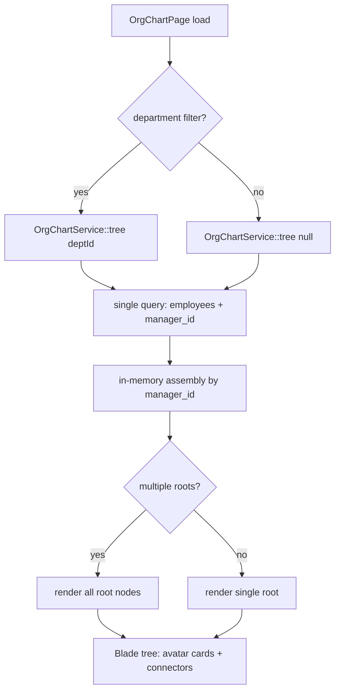

# Org Chart — Architecture

Intended design for the org-chart visualization. Not yet built.

## Services & Actions

- `OrgChartService::tree(?string $departmentId = null): array<OrgNodeData>` — single query, cycle-safe (cycles are prevented at write time by [[../employee-profiles/_module|hr.profiles]]). Builds the tree with one query plus in-memory assembly (no N+1 recursion).
- `ReassignManagerAction::run(string $employeeId, ?string $newManagerId): void` — delegates to `EmployeeService::update` (cycle check lives there).

Follows [[../../../architecture/patterns/interface-service|interface→service]] for `OrgChartService` and the actions pattern for `ReassignManagerAction`.

## Filament Artifacts

**Nav group:** Employees

| Artifact | Kind ([[../../../architecture/ui-strategy]] row) | Blueprint / Tweaks | Notes |
|---|---|---|---|
| `OrgChartPage` | #11 Org chart / tree custom page | [[../../../architecture/patterns/page-blueprints#Org Chart / Tree]] | Livewire + Alpine/JS tree in Blade; dept filter in header; reassign modal (tree-select); PNG/PDF/CSV export *(assumed: client-side render-to-image for PNG, spatie/laravel-pdf for PDF)* |

Custom page approach per [[../../../architecture/patterns/custom-pages]]: the page resolves the tree via `OrgChartService`, passes `OrgNodeData[]` to the Blade view, and the Blade renders avatar cards with vertical connector lines client-side.

**Access contract (mandatory):** `OrgChartPage` is a custom page and MUST state it explicitly — Filament does not auto-gate custom pages:
`canAccess() = Auth::user()->can('hr.org.view') && BillingService::hasModule('hr.org')`
per [[../../../architecture/filament-patterns]] #1. The reassign action additionally requires `hr.org.reassign`; the export action requires `hr.org.export` and cites the `exports` rate limiter ([[security]]). This module owns no tables and exposes no public/portal surface.

## Concurrency

| Write path | Tier | Mechanism |
|---|---|---|
| Manager reassignment (`ReassignManagerAction` → `EmployeeService::update`) | Optimistic | inherits hr.profiles' `updated_at` stale-check on the employee row; cycle re-validated at write time (`ManagerCycleException`) ([[../../../architecture/patterns/optimistic-locking]]) |
| Tree view / department filter / export | n/a | read-only over `hr_employees` + `hr_departments` — no writes owned by this module |

This module owns no tables; the only mutation is a manager reassignment delegated to hr.profiles' owning service. Tiers per [[../../../decisions/decision-2026-07-02-optimistic-locking-standard]].

## Tree Build Flow

## Implementation Notes (intended)

> Softened from the original build-sync notes — these describe the intended look/seed, not completed work.

- Org chart to be styled with avatar cards, vertical connector lines, direct-report badges, and a Section wrapper showing headcount.
- The demo seeder should build a real hierarchy (2 departments, manager chains) so the tree has depth locally. See [[../../../decisions/decision-2026-06-19-strip-to-app-admin-shell]] for the strip context that requires this rebuild.

## Related

- [[_module]]
- [[../../../architecture/patterns/custom-pages]]
- [[../../../architecture/patterns/interface-service]]
