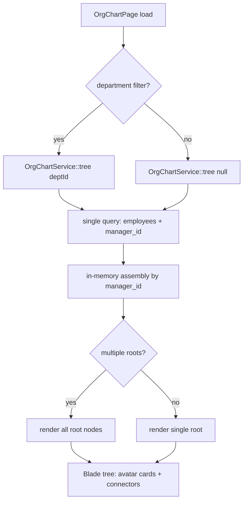

# Org Chart — Architecture

Intended design for the org-chart visualization. Not yet built.

## Services & Actions

- `OrgChartService::tree(?string $departmentId = null): array<OrgNodeData>` — single query, cycle-safe (cycles are prevented at write time by [[../employee-profiles/_module|hr.profiles]]). Builds the tree with one query plus in-memory assembly (no N+1 recursion).
- `ReassignManagerAction::run(string $employeeId, ?string $newManagerId): void` — delegates to `EmployeeService::update` (cycle check lives there).

Follows [[../../../architecture/patterns/interface-service|interface→service]] for `OrgChartService` and the actions pattern for `ReassignManagerAction`.

## Filament Page

| Artifact | Kind ([[../../../architecture/ui-strategy|ui-strategy]] row) | Notes |
|---|---|---|
| `OrgChartPage` | #11 tree-view custom page | Livewire + Alpine/JS tree render in Blade; dept filter in header; PNG/PDF export *(assumed: client-side render-to-image)* |

Custom page approach per [[../../../architecture/patterns/custom-pages]]: the page resolves the tree via `OrgChartService`, passes `OrgNodeData[]` to the Blade view, and the Blade renders avatar cards with vertical connector lines client-side.

## Tree Build Flow

## Implementation Notes (intended)

> Softened from the original build-sync notes — these describe the intended look/seed, not completed work.

- Org chart to be styled with avatar cards, vertical connector lines, direct-report badges, and a Section wrapper showing headcount.
- The demo seeder should build a real hierarchy (2 departments, manager chains) so the tree has depth locally. See [[../../../decisions/decision-2026-06-19-strip-to-app-admin-shell]] for the strip context that requires this rebuild.

## Related

- [[_module]]
- [[../../../architecture/patterns/custom-pages]]
- [[../../../architecture/patterns/interface-service]]
